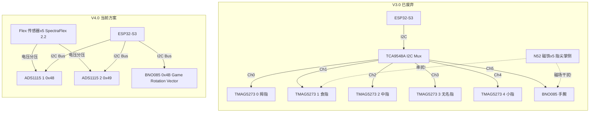

# EchoGlove V4.0 架构图

## 1. 系统总体架构（三子系统）

```mermaid
graph LR
    subgraph "ESP32-S3 (glove_firmware/)"
        A[2×ADS1115 + BNO085<br/>100Hz 采样] --> B[Kalman 滤波 11ch]
        B --> C[Min-Max 归一化]
        C --> D[SlidingWindow 30×11]
        D --> E[L1 1D-CNN+Attn<br/><5ms INT8]
        D --> F[UDP Protobuf<br/>Port 8888]
    end

    subgraph "Python Relay (glove_relay/)"
        F --> G[Protobuf 解析]
        G --> H[置信度路由]
        H -->|confidence>0.85| I[直接输出]
        H -->|confidence≤0.85| J[L2 ST-GCN<br/><100ms]
        J --> K[NLP 语法纠正<br/>CSL→普通话]
        I --> L[WebSocket JSON<br/>Port 8765]
        K --> L
        K --> M[edge-tts TTS<br/>zh-CN-XiaoxiaoNeural]
    end

    subgraph "Web Frontend (glove_web/)"
        L --> N[React 18 + R3F<br/>3D 手骨骼渲染]
        M --> O[TTS 音频播放]
        N --> P[Zustand Store<br/>flex[5] + imu[6]]
    end

    subgraph "Unity (glove_unity/)"
        L --> Q[Unity 2022 LTS<br/>ms-MANO 参数化手]
    end
```

## 2. V3.0 → V4.0 硬件架构对比



## 3. V4.0 I2C 总线拓扑

```
    ESP32-S3                              I2C Bus (400kHz)
  GPIO8=SDA ──────────────────────────────────────────────────
                    │                 │                 │
                    │ 4.7kΩ           │ 4.7kΩ           │ 4.7kΩ
                    │ pull-up         │ pull-up         │ pull-up
                    ▼                 ▼                 ▼
              ┌──────────┐     ┌──────────┐     ┌──────────┐
              │ ADS1115  │     │ ADS1115  │     │ BNO085   │
              │ #1       │     │ #2       │     │ 7Semi    │
              │ 0x48     │     │ 0x49     │     │ 0x4B     │
              │ ADDR=GND │     │ ADDR=VDD │     │ SDO=GND  │
              │          │     │          │     │          │
              │ A0←Flex1 │     │ A0←Flex5 │     │ INT→GPIO │
              │ A1←Flex2 │     │ A1─GND   │     │    21    │
              │ A2←Flex3 │     │ A2─GND   │     │          │
              │ A3←Flex4 │     │ A3─GND   │     │          │
              └──────────┘     └──────────┘     └──────────┘
  GPIO9=SCL ──────────────────────────────────────────────────
```

## 4. V4.0 数据管线全链路

```
┌─────────────────────────────────────────────────────────────────────────┐
│                        V4.0 数据管线全链路                               │
├─────────────────────────────────────────────────────────────────────────┤
│                                                                         │
│  ┌──────── 采样层 ────────┐   ┌──────── 滤波层 ────────┐               │
│  │                        │   │                         │               │
│  │  Flex1-4 → ADS1115#1  │   │  Kalman Filter ×11ch   │               │
│  │  Flex5   → ADS1115#2  │──▶│  Flex: Q=0.001 R=0.05  │               │
│  │  BNO085  → I2C直读    │   │  IMU:  Q=0.01  R=0.1   │               │
│  │                        │   │                         │               │
│  │  输出: 5+6 = 11 floats │   │  输出: 11 floats       │               │
│  └────────────────────────┘   └────────────┬────────────┘               │
│                                            │                            │
│                                            ▼                            │
│                               ┌──────── 归一化 ────────┐               │
│                               │  Min-Max [0,1]         │               │
│                               │  2s校准: flat→max      │               │
│                               └────────────┬────────────┘               │
│                                            │                            │
│                                            ▼                            │
│                               ┌──────── 滑动窗口 ──────┐               │
│                               │  30帧 × 11特征         │               │
│                               │  PSRAM 环形缓冲        │               │
│                               └──────┬──────────┬──────┘               │
│                                      │          │                       │
│                    ┌─────────────────┘          └──────────────────┐    │
│                    ▼                                              ▼    │
│         ┌──── L1 边缘推理 ────┐                       ┌── 通信层 ──┐    │
│         │ 1D-CNN+Attention    │                       │            │    │
│         │ 输入: 30×11=330     │                       │ UDP Proto  │    │
│         │ ~20K params INT8    │                       │ Port 8888  │    │
│         │ <5ms 推理           │                       │ 16 floats  │    │
│         │                     │                       └──────┬─────┘    │
│         │ confidence>0.85?    │                              │          │
│         │ YES → 直接输出      │                              ▼          │
│         │ NO  → 触发L2       │                    ┌── Relay层 ──────┐   │
│         └─────────────────────┘                    │  Protobuf→JSON  │   │
│                                                     │  置信度路由      │   │
│                                                     │  ├─>0.85: 直出  │   │
│                                                     │  └─≤0.85: L2   │   │
│                                                     │                 │   │
│                                                     │  L2 ST-GCN     │   │
│                                                     │  Feature Lift  │   │
│                                                     │  11→42→21骨骼  │   │
│                                                     │  GraphConv     │   │
│                                                     │  <100ms        │   │
│                                                     │                 │   │
│                                                     │  NLP: SOV→SVO  │   │
│                                                     │  TTS: edge-tts │   │
│                                                     └───────┬─────────┘   │
│                                                             │              │
│                                                             ▼              │
│                                                   ┌── 渲染层 ──────────┐ │
│                                                   │  WebSocket :8765   │ │
│                                                   │  ├ React+R3F 3D手  │ │
│                                                   │  └ Unity ms-MANO   │ │
│                                                   │  TTS 音频URL       │ │
│                                                   └────────────────────┘ │
└─────────────────────────────────────────────────────────────────────────┘
```

## 5. V4.0 ST-GCN 伪骨骼映射（方案C: 混合映射）

```
    输入特征 (11维)              Feature Lifting              21节点手部骨骼图
    ┌──────────────┐         ┌─────────────────┐         ┌─────────────────────┐
    │ Flex 1 (拇指) │────────▶│ 直接赋值        │────────▶│ 节点2: Thumb_MCP ⭐ │
    │ Flex 2 (食指) │────────▶│ 直接赋值        │────────▶│ 节点5: Index_MCP ⭐ │
    │ Flex 3 (中指) │────────▶│ 直接赋值        │────────▶│ 节点9: Middle_MCP⭐ │
    │ Flex 4 (无名) │────────▶│ 直接赋值        │────────▶│ 节点13:Ring_MCP  ⭐ │
    │ Flex 5 (小指) │────────▶│ 直接赋值        │────────▶│ 节点17:Pinky_MCP ⭐ │
    │              │         │                 │         │                     │
    │ IMU Euler(3) │────────▶│ 直接赋值        │────────▶│ 节点0: Wrist     🟢 │
    │ IMU Gyro(3)  │─┐      │                 │         │                     │
    │              │ │      │ Linear(11→42)   │         │ 节点1,3,4: Thumb   │
    │ Flex 1-5     │─┤─────▶│ 可训练映射      │────────▶│ 节点6,7,8: Index   │
    │ IMU 全部     │ │      │ 学习中间节点    │         │ 节点10,11,12: Mid   │
    │              │ │      │ 最优插值        │         │ 节点14,15,16: Ring  │
    └──────────────┘ │      └─────────────────┘         │ 节点18,19,20: Pinky │
                   │                                   │                     │
                   │                                   │ 掌骨横链:           │
                   │                                   │ 5─9─13─17          │
                   └──────────────────────────────────▶└─────────────────────┘
    
    ⭐ = Flex直接赋值的MCP关节    🟢 = BNO085直接赋值的腕关节
    其余15个节点通过可学习的Feature Lifting层插值
```

## 6. FreeRTOS 双核任务架构

```
    ┌─── Core 1 (传感器) ──────────────────────────────┐
    │                                                    │
    │  Task_SensorRead (优先级3, 100Hz, 栈4096)         │
    │  ┌──────────────────────────────────────────┐     │
    │  │ 1. ADS1115 #1: 读取Flex1-4 (4通道轮询)  │     │
    │  │ 2. ADS1115 #2: 读取Flex5   (1通道)       │     │
    │  │ 3. BNO085: 读取四元数+角速度              │     │
    │  │ 4. Kalman滤波 (11通道)                    │     │
    │  │ 5. 归一化 + 推入SlidingWindow             │     │
    │  └──────────────────────────────────────────┘     │
    │                                                    │
    │           │ SPSC Ring Buffer (PSRAM)               │
    │           │                                        │
    └───────────┼────────────────────────────────────────┘
                │
                ▼
    ┌─── Core 0 (计算+通信) ────────────────────────────┐
    │                                                    │
    │  Task_Inference (优先级2, ~30Hz, 栈8192)          │
    │  ┌──────────────────────────────────────────┐     │
    │  │ 1. 从SlidingWindow取30×11帧              │     │
    │  │ 2. L1模型推理 (1D-CNN+Attention)          │     │
    │  │ 3. 输出手势ID + 置信度                    │     │
    │  └──────────────────────────────────────────┘     │
    │                                                    │
    │  Task_Comms (优先级1, 100Hz, 栈8192)              │
    │  ┌──────────────────────────────────────────┐     │
    │  │ 1. BLE: WiFi配网 (仅此功能)              │     │
    │  │ 2. WiFi UDP: Protobuf发送 (Port 8888)     │     │
    │  │ 3. 包含L1推理结果 + L2请求标志            │     │
    │  └──────────────────────────────────────────┘     │
    └────────────────────────────────────────────────────┘
```

## 7. 全链路迁移影响热力图

```
影响程度: 🟢不变  🟡需适配  🔴需重写/重训  ⚪已删除  🆕新增

┌──────────────────────┬──────────┬──────────────────────────────────┐
│ 层级                  │ 影响度    │ 说明                              │
├──────────────────────┼──────────┼──────────────────────────────────┤
│ TMAG5273 ×5          │ ⚪ 删除   │ 不再使用                          │
│ TCA9548A Mux         │ ⚪ 删除   │ 不再需要                          │
│ N52 磁铁 ×5          │ ⚪ 删除   │ 消除干扰源                        │
│ ADS1115 ×2           │ 🆕 新增   │ 16-bit I2C ADC                   │
│ Flex 传感器 ×5       │ 🆕 新增   │ SpectraFlex 2.2"                 │
├──────────────────────┼──────────┼──────────────────────────────────┤
│ ADS1115 驱动         │ 🆕 新增   │ 新写I2C ADC驱动                   │
│ FlexManager          │ 🔴 重写   │ 从占位符→完整实现                  │
│ TMG5273 驱动         │ ⚪ 删除   │                                   │
│ TCA9548A 驱动        │ ⚪ 删除   │                                   │
│ SensorManager        │ 🔴 重写   │ 简化采样拓扑                      │
├──────────────────────┼──────────┼──────────────────────────────────┤
│ SensorData 结构体    │ 🟡 适配   │ 21维→11维                         │
│ Kalman Filter        │ 🟡 适配   │ 21ch→11ch, 调参                   │
│ SlidingWindow        │ 🟡 适配   │ 30×21→30×11                      │
│ FeatureNormalizer    │ 🟡 适配   │ 21ch→11ch, 重做校准               │
├──────────────────────┼──────────┼──────────────────────────────────┤
│ Protobuf 字段        │ 🟡 适配   │ hall→0, flex→5(已预留!)           │
│ WebSocket JSON       │ 🟡 适配   │ hall[]→flex[]                     │
├──────────────────────┼──────────┼──────────────────────────────────┤
│ L1 模型输入          │ 🔴 重训   │ 630维→330维, 需新数据              │
│ ST-GCN 映射层        │ 🔴 重写   │ Linear(11→42) 新特征提升           │
│ 训练数据             │ 🔴 全新   │ 46手势×10次=460样本               │
├──────────────────────┼──────────┼──────────────────────────────────┤
│ L1/L2 推理逻辑       │ 🟢 不变   │ 置信度路由不变                     │
│ 模型热切换           │ 🟢 不变   │ YAML配置不变                      │
├──────────────────────┼──────────┼──────────────────────────────────┤
│ NLP 语法纠正         │ 🟢 不变   │ 纯下游逻辑                        │
│ TTS 引擎             │ 🟢 不变   │ 与传感器无关                      │
├──────────────────────┼──────────┼──────────────────────────────────┤
│ R3F 3D 渲染          │ 🟡 适配   │ Flex→角度直射,更简单               │
│ 21节点骨骼定义       │ 🟢 不变   │ 节点数和拓扑不变                   │
│ Unity ms-MANO        │ 🟡 适配   │ 参数映射更自然                    │
└──────────────────────┴──────────┴──────────────────────────────────┘
```
