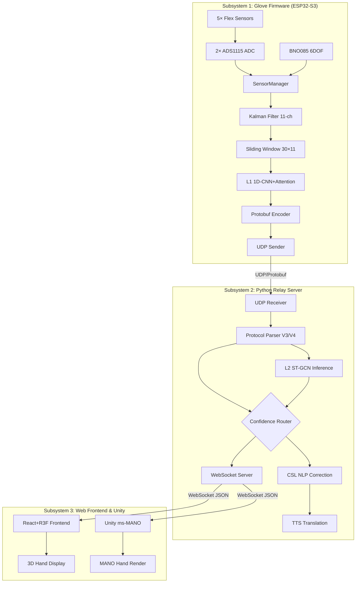
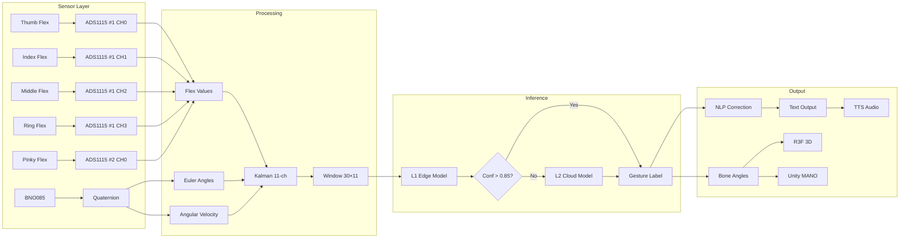
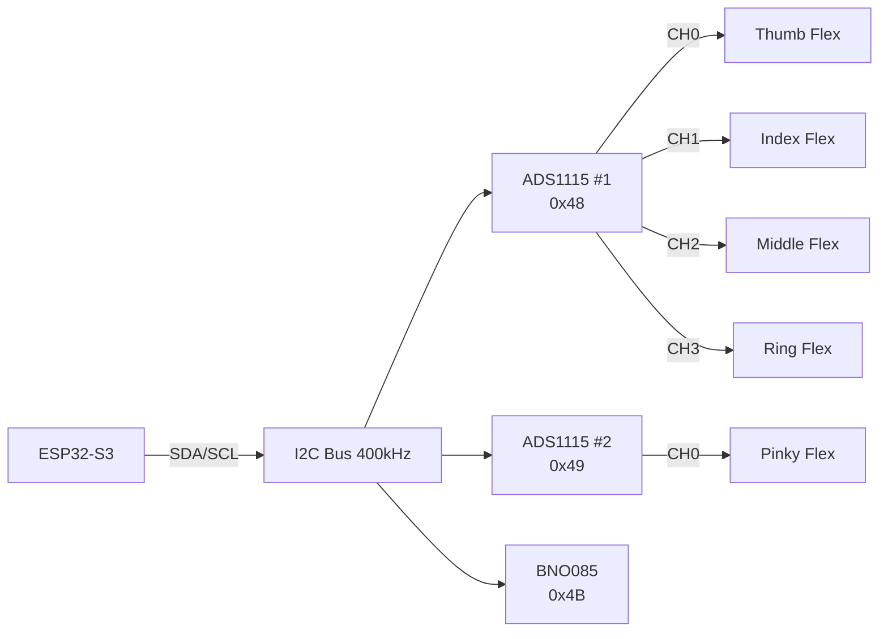
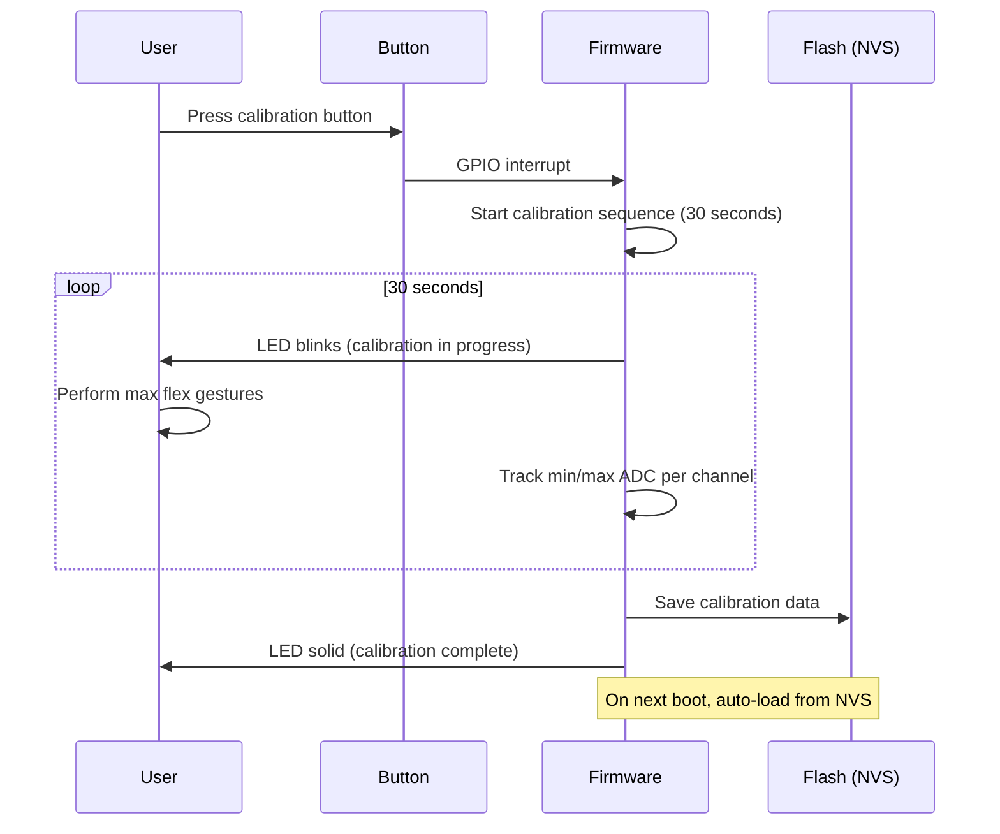

# EchoGlove SOP-SPEC-PLAN V4.0

> **Document Version:** 4.0  
> **Date:** 2026-06-01  
> **Status:** Active  
> **Supersedes:** V3.0 (Hall+Magnet architecture)  
> **Migration:** Hall-effect → Flex Sensor architecture  

---

## Table of Contents

1. [Project Vision & Goals](#1-project-vision--goals)
2. [Constraints & Assumptions](#2-constraints--assumptions)
3. [V3→V4 Migration Decision (ADRs)](#3-v3v4-migration-decision-adrs)
4. [System Architecture](#4-system-architecture)
5. [Hardware Architecture](#5-hardware-architecture)
6. [Feature Vector Definition](#6-feature-vector-definition)
7. [Phase 1: HAL & Drivers](#7-phase-1-hal--drivers)
8. [Phase 2: Signal Processing](#8-phase-2-signal-processing)
9. [Phase 3: L1 Edge Inference](#9-phase-3-l1-edge-inference)
10. [Phase 4: Communication](#10-phase-4-communication)
11. [Phase 5: Python Relay & L2](#11-phase-5-python-relay--l2)
12. [Phase 6: Rendering](#12-phase-6-rendering)
13. [Phase 7: Integration Testing](#13-phase-7-integration-testing)
14. [Phase 8: Dataset Collection](#14-phase-8-dataset-collection)
15. [Phase 9: Deployment](#15-phase-9-deployment)
16. [BOM Comparison](#16-bom-comparison)
17. [Wiring Diagram](#17-wiring-diagram)
18. [Full Chain Impact Matrix](#18-full-chain-impact-matrix)
19. [Risk Register](#19-risk-register)

---

## 1. Project Vision & Goals

### 1.1 Vision

Build an open-source, low-cost (<$30 BOM), high-accuracy (>95%) smart data glove for Chinese Sign Language (CSL) recognition that enables real-time bidirectional communication between deaf/hard-of-hearing individuals and the hearing world.

### 1.2 Goals

| ID | Goal | Metric | Target |
|---|---|---|---|
| G1 | Sign recognition accuracy | Top-1 accuracy on CSL-S100 dataset | ≥95% |
| G2 | End-to-end latency | Sensor → text display | <200ms |
| G3 | BOM cost | Component cost per glove | <$30 |
| G4 | Battery life | Continuous operation | >4 hours |
| G5 | Weight | Total glove weight | <80g |
| G6 | Calibration time | First-time user setup | <2 minutes |
| G7 | Gesture vocabulary | Supported CSL signs | ≥200 |

### 1.3 Non-Goals

- Full ASL fingerspelling (future work)
- Two-handed sign recognition (single glove V4)
- Medical-grade hand rehabilitation metrics
- Waterproof/submersible operation

---

## 2. Constraints & Assumptions

### 2.1 Hardware Constraints

- **MCU:** ESP32-S3-WROOM-1 (dual-core 240MHz, 8MB PSRAM, 8MB Flash)
- **Framework:** ESP-IDF 5.x via PlatformIO
- **RTOS:** FreeRTOS (ESP-IDF built-in)
- **I2C bus:** Single bus, 400kHz (100kHz if stability issues)
- **ADC:** External 16-bit (ADS1115) — ESP32-S3 internal ADC is 12-bit and non-linear

### 2.2 Software Constraints

- **L1 model:** <50K parameters, INT8 quantized, <10ms inference on ESP32-S3
- **L2 model:** <500K parameters, runs on Python relay server
- **Communication:** Protobuf over UDP (firmware→relay), WebSocket JSON (relay→frontend)
- **Frontend:** React + React Three Fiber (R3F)
- **3D Rendering:** Unity with ms-MANO hand model

### 2.3 Assumptions

- Flex sensors are mounted on the dorsal (back) side of each finger
- Single-hand operation (right hand dominant, left hand support in future)
- WiFi connectivity available for L2 cloud inference
- User can perform a 30-second calibration gesture sequence

---

## 3. V3→V4 Migration Decision (ADRs)

### ADR-001: Abandon Hall-Effect Sensing

**Context:** V3 uses 5× TMAG5273 Hall-effect sensors with 5× N52 neodymium magnets on fingertips.

**Decision:** Remove all Hall-effect sensors and magnets.

**Rationale:**
- Magnetic cross-talk: 3–10 dB SNR degradation in signing gestures (fingers 12–15mm apart)
- BNO085 magnetometer saturation: 4–16× geomagnetic field at sensor location
- Temperature drift: 1.2–1.8% per 10°C, requiring continuous recalibration
- 3 of 5 failure modes are physics-limited and unfixable

**Consequences:** Complete sensor subsystem replacement required.

**Status:** Accepted

### ADR-002: Adopt Flex Sensors

**Context:** Need a finger articulation sensor that is independent per finger, linear, and proven in SLR literature.

**Decision:** Use 5× flex sensors (SpectraFlex 2.2" or 国产替代) with voltage divider circuits.

**Rationale:**
- 95–99% SLR accuracy in published literature (2020–2026)
- Linear resistance-vs-angle response
- Electrically independent per channel (no cross-talk)
- Lower cost than Hall+magnet ($2–3/sensor vs. $4–5/sensor+Magnet)
- Proven in Cyberglove, GloveOne, and 100+ research prototypes

**Consequences:** Requires external ADC (ADS1115) for 16-bit resolution.

**Status:** Accepted

### ADR-003: Use ADS1115 as External ADC

**Context:** ESP32-S3 internal ADC is 12-bit with known non-linearity issues. Flex sensors need stable, high-resolution ADC.

**Decision:** Use 2× ADS1115 16-bit I2C ADC modules.

**Rationale:**
- 16-bit resolution (65536 counts) vs. 12-bit (4096 counts)
- Programmable gain amplifier (PGA) for optimal voltage range
- 860 SPS continuous mode — sufficient for 100Hz sampling
- I2C interface — no additional GPIO needed
- Dual instance support (0x48, 0x49) — 8 channels total

**Consequences:** Adds 2 I2C devices to bus. Total bus devices: 3 (2× ADS1115 + BNO085).

**Status:** Accepted

### ADR-004: BNO085 6DOF Mode (Game Rotation Vector)

**Context:** V3 used BNO085 in 9DOF mode (with magnetometer). Magnetometer is now unusable due to removed magnets (ADR-001) and was already compromised by fingertip magnets.

**Decision:** Configure BNO085 for SH2_GAME_ROTATION_VECTOR (6DOF, no magnetometer).

**Rationale:**
- Game Rotation Vector uses gyro + accel only — no magnetometer dependency
- Same rotation accuracy for hand-relative gestures (absolute heading not needed for SLR)
- Eliminates all magnetometer-related calibration complexity
- Lower power consumption (magnetometer disabled)

**Consequences:** Yaw will drift over time. Acceptable for SLR (signs are defined by finger articulation, not absolute heading).

**Status:** Accepted

---

## 4. System Architecture

### 4.1 Three-Subsystem Overview



### 4.2 Data Flow



---

## 5. Hardware Architecture

### 5.1 I2C Bus Topology



### 5.2 GPIO Pin Allocation

| GPIO | Function | Connected To | Notes |
|---|---|---|---|
| GPIO1 | UART0 TX | USB-UART | Debug/programming |
| GPIO3 | UART0 RX | USB-UART | Debug/programming |
| GPIO8 | I2C0 SDA | ADS1115×2, BNO085 | 4.7kΩ pull-up to 3.3V |
| GPIO9 | I2C0 SCL | ADS1115×2, BNO085 | 4.7kΩ pull-up to 3.3V |
| GPIO10 | BNO085 RST | BNO085 RST pin | Active low, 10kΩ pull-up |
| GPIO11 | BNO085 INT | BNO085 INT pin | Data ready interrupt |
| GPIO12 | Status LED | WS2812B | System status indicator |
| GPIO13 | Button | Calibration button | Active low, 10kΩ pull-up |
| GPIO14–17 | Reserved | — | Future expansion |
| GPIO18 | USB D- | USB | Native USB |
| GPIO19 | USB D+ | USB | Native USB |
| GPIO20–21 | Reserved | — | Future expansion |
| GPIO47 | Power control | Flex sensor VCC | MOSFET switch for power saving |
| GPIO48 | Neopixel | Onboard LED | ESP32-S3 devkit |

### 5.3 Flex Sensor Voltage Divider Circuit

```
        VCC (3.3V)
            │
            ├───[R_fixed 47kΩ]───┬─── ADC Input (ADS1115 AINx)
            │                     │
            │              [Flex Sensor]
            │                     │
            └─────────────────────┴─── GND
```

**Voltage calculation:**
```
V_out = VCC × R_flex / (R_fixed + R_flex)

Unbent (25kΩ): V_out = 3.3 × 25000 / (47000 + 25000) = 1.146V
Bent 90° (125kΩ): V_out = 3.3 × 125000 / (47000 + 125000) = 2.401V

ADC counts (16-bit, ±4.096V PGA):
Unbent: 1.146 / 4.096 × 32768 = 9,168 counts
Bent 90°: 2.401 / 4.096 × 32768 = 19,208 counts
Dynamic range: 10,040 counts (15.3% of 16-bit range)
```

**Alternative R_fixed values:**

| R_fixed | Unbent V | Bent 90° V | Dynamic Range | Notes |
|---|---|---|---|---|
| 22kΩ | 1.52V | 2.70V | 9,440 counts | More range, less resolution |
| 47kΩ | 1.15V | 2.40V | 10,040 counts | **Recommended** |
| 100kΩ | 0.76V | 1.95V | 9,523 counts | Better linearity |

### 5.4 Power Distribution

```
Battery (3.7V LiPo)
    │
    ├──[LDO 3.3V]──┬── ESP32-S3 VCC
    │               ├── BNO085 VCC
    │               ├── ADS1115 #1 VDD
    │               ├── ADS1115 #2 VDD
    │               └── Flex sensor voltage dividers (via GPIO47 MOSFET)
    │
    └──[Direct]──── ESP32-S3 USB (charging)
```

---

## 6. Feature Vector Definition

### 6.1 Per-Frame Feature Vector (11 dimensions)

| Index | Channel | Source | Unit | Range | Notes |
|---|---|---|---|---|---|
| 0 | Thumb flex | ADS1115 #1 CH0 | % | 0–100 | 0=unbent, 100=fully bent |
| 1 | Index flex | ADS1115 #1 CH1 | % | 0–100 | Calibrated per-user |
| 2 | Middle flex | ADS1115 #1 CH2 | % | 0–100 | EMA filtered |
| 3 | Ring flex | ADS1115 #1 CH3 | % | 0–100 | — |
| 4 | Pinky flex | ADS1115 #2 CH0 | % | 0–100 | — |
| 5 | Euler X (roll) | BNO085 Game RV | degrees | -180 to +180 | Quaternion→Euler |
| 6 | Euler Y (pitch) | BNO085 Game RV | degrees | -90 to +90 | — |
| 7 | Euler Z (yaw) | BNO085 Game RV | degrees | -180 to +180 | Drift acceptable |
| 8 | Gyro X | BNO085 Gyro | °/s | -2000 to +2000 | Angular velocity |
| 9 | Gyro Y | BNO085 Gyro | °/s | -2000 to +2000 | — |
| 10 | Gyro Z | BNO085 Gyro | °/s | -2000 to +2000 | — |

### 6.2 Sliding Window

- **Window size:** 30 frames (300ms at 100Hz)
- **Window stride:** 1 frame (10ms hop)
- **Input to L1 model:** 30 × 11 = **330 dimensions**
- **Buffer type:** Circular buffer in PSRAM

### 6.3 Comparison with V3

| Property | V3 (Hall+Magnet) | V4 (Flex+IMU6DOF) |
|---|---|---|
| Dimensions per frame | 15 | 11 |
| Window × dims | 30 × 15 = 450 | 30 × 11 = 330 |
| Finger channels | 5 (Hall mT) | 5 (Flex %) |
| IMU channels | 10 (quat×4 + accel×3 + gyro×3) | 6 (euler×3 + gyro×3) |
| Magnetometer data | Yes (unreliable) | No (disabled) |
| Buffer size (bytes) | 900 (float16) | 660 (float16) |

---

## 7. Phase 1: HAL & Drivers

### 7.1 ADS1115 Driver

**File:** `glove_firmware/components/ads1115/ads1115.c`, `ads1115.h`

**Requirements:**
- ESP-IDF I2C driver (i2c_master or legacy i2c_driver_install)
- Support dual instances (address 0x48, 0x49)
- Configurable PGA (±4.096V recommended for flex sensors)
- Data rate: 860 SPS continuous mode
- Single-shot mode for power saving (alternative)
- Mutex-protected I2C access (shared bus with BNO085)
- Error handling: timeout, bus recovery, NACK detection

**API:**
```c
esp_err_t ads1115_init(i2c_port_t port, uint8_t addr, ads1115_handle_t *handle);
esp_err_t ads1115_read_channel(ads1115_handle_t handle, uint8_t channel, int16_t *raw);
esp_err_t ads1115_read_all_channels(ads1115_handle_t handle, int16_t raw[4]);
esp_err_t ads1115_set_pga(ads1115_handle_t handle, ads1115_pga_t pga);
esp_err_t ads1115_set_data_rate(ads1115_handle_t handle, ads1115_rate_t rate);
```

### 7.2 BNO085 6DOF Driver Modification

**File:** `glove_firmware/components/bno085/bno085.c`, `bno085.h`

**Changes:**
- Initialize with SH2_GAME_ROTATION_VECTOR instead of SH2_ROTATION_VECTOR
- Disable magnetometer calibration reports
- Output: quaternion (w,x,y,z) → convert to euler (roll, pitch, yaw) + gyro (x,y,z)
- Keep existing interrupt-driven data ready detection

### 7.3 FlexManager Module

**File:** `glove_firmware/components/flex_manager/flex_manager.c`, `flex_manager.h`

**Requirements:**
- Calibration: capture min/max ADC values during calibration sequence
- NVS persistence: store calibration data in ESP32 NVS flash
- EMA filter: α = 0.15 (configurable)
- Percentage normalization: 0% = unbent (min ADC), 100% = fully bent (max ADC)
- Fault detection: out-of-range values, stuck sensor

**API:**
```c
esp_err_t flex_manager_init(flex_config_t *config);
esp_err_t flex_manager_calibrate_start(void);  // Begin calibration
esp_err_t flex_manager_calibrate_sample(void);  // Capture current values
esp_err_t flex_manager_calibrate_end(void);     // Save to NVS
esp_err_t flex_manager_read(float percentages[5]);  // Get filtered values
esp_err_t flex_manager_load_calibration(void);  // Load from NVS
bool flex_manager_is_calibrated(void);
```

### 7.4 SensorManager Rewrite

**File:** `glove_firmware/components/sensor_manager/sensor_manager.c`

**Responsibilities:**
- Coordinate ADS1115 #1, #2, and BNO085 reads
- Assemble 11-dim feature vector per frame
- Thread-safe (mutex for I2C bus)
- Timing: maintain 100Hz sampling rate (10ms period)
- Error handling: sensor timeout → use last valid value → flag fault

**Task structure (FreeRTOS):**
```c
void sensor_manager_task(void *pvParameters) {
    TickType_t xLastWakeTime = xTaskGetTickCount();
    while (1) {
        // 1. Read flex sensors (ADS1115 #1 + #2) ~2ms
        // 2. Read BNO085 (quaternion + gyro) ~1ms
        // 3. Convert quaternion → euler ~0.1ms
        // 4. Assemble 11-dim frame ~0.1ms
        // 5. Push to Kalman filter queue
        // Total budget: <8ms (80% of 10ms period)
        vTaskDelayUntil(&xLastWakeTime, pdMS_TO_TICKS(10));
    }
}
```

---

## 8. Phase 2: Signal Processing

### 8.1 Kalman Filter (11-channel)

**File:** `glove_firmware/components/kalman_filter/kalman_filter.c`

**Configuration:**
- State dimension: 11
- Measurement dimension: 11
- State transition: identity (constant model)
- Process noise Q: tuned per channel type
  - Flex channels: higher Q (fast response, ~20ms mechanical time constant)
  - Euler channels: lower Q (smooth orientation)
  - Gyro channels: medium Q

**Measurement noise R (initial estimates):**
| Channel | Noise (σ) | Unit | Source |
|---|---|---|---|
| Flex (0–4) | 0.5 | % | ADS1115 quantization + sensor noise |
| Euler (5–7) | 0.3 | degrees | BNO085 Game RV spec |
| Gyro (8–10) | 0.1 | °/s | BNO085 gyro noise density |

### 8.2 Sliding Window Buffer

**File:** `glove_firmware/components/sliding_window/sliding_window.c`

**Configuration:**
- Window size: 30 frames
- Dimensions: 11
- Storage: circular buffer in PSRAM
- Output: flattened 330-dim vector for L1 model input
- Update rate: 100Hz (every new frame, oldest frame dropped)

### 8.3 Calibration Workflow



---

## 9. Phase 3: L1 Edge Inference

### 9.1 Model Architecture (Updated for V4)

**File:** `glove_firmware/models/l1_model_v4.py` (training script)
**File:** `glove_firmware/models/l1_model_v4_int8.tflite` (deployed model)

**Architecture:**
```
Input: 330-dim (30 frames × 11 channels)
    │
    ├── Conv1D(32, kernel=3, padding='same') + ReLU
    ├── Conv1D(64, kernel=3, padding='same') + ReLU
    ├── Conv1D(64, kernel=3, padding='same') + ReLU
    │
    ├── Self-Attention(d_model=64, heads=4)
    │
    ├── GlobalAveragePooling1D
    │
    ├── Dense(128) + ReLU + Dropout(0.3)
    ├── Dense(64) + ReLU + Dropout(0.2)
    ├── Dense(num_classes) + Softmax
    │
    Output: gesture class probabilities
```

**Parameters:** ~28K (vs. V3's ~34K — slightly smaller due to reduced input)

**INT8 Quantization:**
- Post-training quantization (PTQ) with calibration dataset
- Representative dataset: 1000 samples from validation set
- Target: <1% accuracy loss from float32

### 9.2 Training Configuration

| Parameter | Value |
|---|---|
| Dataset | CSL-S100 (recalculated for V4 sensors) |
| Epochs | 100 |
| Batch size | 64 |
| Learning rate | 1e-3 (Adam) |
| LR schedule | ReduceLROnPlateau(patience=10, factor=0.5) |
| Loss | CrossEntropyLoss |
| Augmentation | Time warping, noise injection, rotation |
| Validation split | 20% stratified |

---

## 10. Phase 4: Communication

### 10.1 Protobuf V4 Schema

**File:** `glove_firmware/proto/sensor_frame.proto`

```protobuf
syntax = "proto3";
package echoglove;

message SensorFrame {
    uint32 timestamp_ms = 1;         // Milliseconds since boot
    uint32 version = 2;              // Protocol version (4 for V4)
    
    // Flex sensor values (0-100%)
    repeated float flex_values = 3;  // [thumb, index, middle, ring, pinky]
    
    // IMU data (6DOF Game Rotation Vector)
    repeated float imu_euler = 4;    // [roll, pitch, yaw] in degrees
    repeated float imu_gyro = 5;     // [gx, gy, gz] in °/s
    
    // L1 inference result
    uint32 l1_class_id = 6;          // Predicted gesture class
    float l1_confidence = 7;         // Confidence score [0,1]
    
    // System status
    uint32 battery_mv = 8;           // Battery voltage in mV
    uint32 wifi_rssi = 9;            // WiFi signal strength
    uint32 uptime_s = 10;            // Seconds since boot
}
```

### 10.2 Version Detection (Relay)

The relay server auto-detects V3 vs V4 based on:
1. **Protobuf version field** (preferred): `version == 3` or `version == 4`
2. **Packet size heuristic**: V3 packets are larger (15-dim) than V4 (11-dim)
3. **Field presence**: V3 has `hall_values[]`, V4 has `flex_values[]`

---

## 11. Phase 5: Python Relay & L2

### 11.1 ST-GCN Pseudo-Skeleton Remapping

**File:** `glove_relay/glove_relay/st_gcn_mapper.py`

The ST-GCN model expects a 21-node hand skeleton graph. Flex sensor values must be mapped to skeleton nodes.

#### Scheme A: Direct 1:1 Mapping (MVP)

```
Flex Sensor → Skeleton Node
───────────────────────────
Thumb flex  → Node 1 (thumb MCP)
Index flex  → Node 5 (index MCP)
Middle flex → Node 9 (middle MCP)
Ring flex   → Node 13 (ring MCP)
Pinky flex  → Node 17 (pinky MCP)
IMU euler   → Node 0 (wrist)
Other nodes → Interpolated (constant offsets)
```

**Pros:** Simple, fast, no kinematic model needed  
**Cons:** Only 5 of 21 nodes have real data

#### Scheme B: Kinematic Model

```
Each flex sensor → 3 joints (MCP, PIP, DIP)
MCP angle = flex_value × 1.0
PIP angle = flex_value × 0.8
DIP angle = flex_value × 0.6
```

**Pros:** All 15 finger joints have data  
**Cons:** Kinematic ratios are approximate, may not match all users

#### Scheme C: Hybrid (Recommended)

```
Flex sensor → MCP joint (direct measurement)
MCP angle → PIP joint (× 0.8 ratio)
MCP angle → DIP joint (× 0.6 ratio)
IMU euler → Wrist node (direct)
Thumb: Use different ratios (CMC, MCP, IP)
```

**Pros:** Best accuracy/complexity tradeoff  
**Cons:** Requires per-finger kinematic calibration

**Recommendation:** Start with Scheme A for MVP, upgrade to Scheme C for production.

### 11.2 Confidence Routing

```python
if l1_confidence > 0.85:
    gesture = l1_class_id        # Use edge inference
else:
    gesture = l2_st_gcn(frame)   # Use cloud inference
```

### 11.3 CSL NLP & TTS (Unchanged)

- **CSL NLP:** Grammar correction for CSL sentence structure — operates on gesture labels
- **TTS:** Bidirectional translation (CSL ↔ Mandarin/English) — operates on text

---

## 12. Phase 6: Rendering

### 12.1 R3F Simplified Flex→Bone Mapping

**File:** `glove_web/src/components/HandSkeleton.jsx`

```javascript
function flexToBoneAngles(flexPercent, fingerIndex) {
    // MCP joint: direct mapping
    const mcpAngle = flexPercent * 1.5;  // 0% → 0°, 100% → 150°
    
    // PIP joint: 80% of MCP
    const pipAngle = mcpAngle * 0.8;
    
    // DIP joint: 60% of MCP
    const dipAngle = mcpAngle * 0.6;
    
    // Thumb: different kinematic chain
    if (fingerIndex === 0) {
        return {
            cmc: mcpAngle * 0.5,
            mcp: mcpAngle * 0.8,
            ip: mcpAngle * 0.7
        };
    }
    
    return { mcp: mcpAngle, pip: pipAngle, dip: dipAngle };
}
```

### 12.2 Unity ms-MANO Adaptation

**File:** `glove_unity/Assets/Scripts/ManoMapper.cs`

**Changes:**
- Input: 5 flex percentages + 3 euler angles (was: 5 Hall values + quaternion)
- Mapping: flex% → MANO θ parameters (hand pose coefficients)
- Training: Retrain mapping network with new sensor data
- No change to MANO model itself

---

## 13. Phase 7: Integration Testing

### 13.1 Test Matrix

| Test ID | Layer | Description | Pass Criteria | Priority |
|---|---|---|---|---|
| T1.1 | Hardware | I2C bus scan detects all 3 devices | All 3 addresses respond | P0 |
| T1.2 | Hardware | ADS1115 reads valid ADC values | 0–65535 range, noise <100 LSB | P0 |
| T1.3 | Hardware | BNO085 returns valid quaternion | |q| ≈ 1.0 ± 0.01 | P0 |
| T1.4 | Hardware | Flex sensor voltage divider | V_out in 0.5–3.0V range | P0 |
| T2.1 | Drivers | ADS1115 dual instance | Both instances read independently | P0 |
| T2.2 | Drivers | Flex calibration round-trip | NVS save/load matches | P0 |
| T2.3 | Drivers | BNO085 6DOF mode | Game RV reports valid rotation | P0 |
| T3.1 | Sampling | 100Hz sustained rate | <2% jitter over 60 seconds | P1 |
| T3.2 | Sampling | 11-dim frame assembly | All channels populated, no zeros | P0 |
| T4.1 | Filtering | Kalman filter convergence | Output settles within 1 second | P1 |
| T5.1 | L1 Model | Inference latency | <10ms per frame on ESP32-S3 | P0 |
| T5.2 | L1 Model | Accuracy on test set | ≥90% (target 95%) | P0 |
| T6.1 | Communication | UDP packet delivery | <0.1% loss on LAN | P1 |
| T6.2 | Communication | V3/V4 auto-detection | Both versions handled correctly | P1 |
| T7.1 | Relay | ST-GCN inference | Output matches expected gestures | P1 |
| T7.2 | Relay | Confidence routing | L1/L2 switching works correctly | P1 |
| T8.1 | Frontend | R3F hand renders correctly | Visual match to expected pose | P2 |
| T9.1 | E2E | Full pipeline latency | <200ms sensor→display | P0 |
| T9.2 | E2E | 10-gesture recognition | ≥90% accuracy end-to-end | P0 |

---

## 14. Phase 8: Dataset Collection

### 14.1 Collection Protocol

- **Users:** Minimum 50 participants (diverse hand sizes, ages)
- **Gestures:** 200 CSL signs × 50 repetitions = 10,000 samples per user
- **Total:** 50 users × 10,000 = 500,000 samples
- **Duration:** ~4 weeks (100 users × 2 hours each)

### 14.2 Collection Tool

**File:** `glove_web/src/pages/DatasetCollection.jsx`

Web-based tool that:
1. Displays target gesture (video/image)
2. Records sensor stream during gesture
3. Labels data with gesture ID
4. Validates gesture quality (automated checks)
5. Exports as CSV/TFRecord

### 14.3 Data Augmentation

- Time warping (±20% speed)
- Gaussian noise injection (σ = 1%)
- Random rotation (±5°)
- Random scaling (±10%)
- Synthetic gap simulation (sensor dropout)

---

## 15. Phase 9: Deployment

### 15.1 Firmware Deployment

1. Build with PlatformIO: `pio run -e esp32s3`
2. Flash via USB: `pio run -e esp32s3 -t upload`
3. Verify: serial monitor shows sensor readings
4. OTA update support (future)

### 15.2 Relay Deployment

1. `pip install -r requirements.txt`
2. `python -m glove_relay.main --port 5000`
3. Docker: `docker build -t glove-relay . && docker run -p 5000:5000 glove-relay`

### 15.3 Frontend Deployment

1. `cd glove_web && npm install && npm run build`
2. Serve static files or deploy to Vercel/Netlify

---

## 16. BOM Comparison

### 16.1 V3 vs V4 Component Comparison

| Component | V3 Qty | V3 Price | V4 Qty | V4 Price | Change |
|---|---|---|---|---|---|
| ESP32-S3-WROOM-1 | 1 | $3.50 | 1 | $3.50 | Same |
| BNO085 breakout | 1 | $8.00 | 1 | $8.00 | Same |
| TMAG5273 Hall sensor | 5 | $12.50 | 0 | $0 | **Removed** |
| N52 magnet beads (6mm) | 5 | $2.50 | 0 | $0 | **Removed** |
| TCA9548A MUX | 1 | $1.50 | 0 | $0 | **Removed** |
| Flex sensor 2.2" | 0 | $0 | 5 | $12.50 | **Added** |
| ADS1115 breakout | 0 | $0 | 2 | $4.00 | **Added** |
| Resistors (47kΩ) | 0 | $0 | 5 | $0.25 | **Added** |
| Capacitors (100nF) | 5 | $0.25 | 5 | $0.25 | Same |
| LiPo battery 500mAh | 1 | $4.00 | 1 | $4.00 | Same |
| TP4056 charger | 1 | $0.50 | 1 | $0.50 | Same |
| WS2812B LED | 1 | $0.30 | 1 | $0.30 | Same |
| Glove substrate | 1 | $3.00 | 1 | $3.00 | Same |
| PCB/Perfboard | 1 | $2.00 | 1 | $2.00 | Same |
| Connectors/wires | — | $2.00 | — | $2.00 | Same |
| **TOTAL** | | **$39.55** | | **$40.30** | **+$0.75** |

### 16.2 Cost Optimization

| Component | Budget Option | Price | Savings |
|---|---|---|---|
| Flex sensors | 国产替代 (Chinese domestic) | $1.00 each | $7.50 |
| ADS1115 | Generic module (Taobao) | $1.50 each | $1.00 |
| BNO085 | GY-BNO055 (cheaper IMU) | $4.00 | $4.00 |
| **Optimized Total** | | **$27.80** | **-$12.50** |

---

## 17. Wiring Diagram

### 17.1 ASCII Art Wiring Diagram

```
                    ┌─────────────────────────────────────────────┐
                    │            ESP32-S3-WROOM-1                  │
                    │                                             │
                    │  GPIO8 (SDA) ────────┬──────────┬──────    │
                    │                      │          │           │
                    │  GPIO9 (SCL) ────────┼──────────┼──────    │
                    │                      │          │           │
                    │  GPIO10 ──── BNO085 RST          │          │
                    │  GPIO11 ──── BNO085 INT          │          │
                    │  GPIO12 ──── WS2812B             │          │
                    │  GPIO13 ──── Button ── GND       │          │
                    │  GPIO47 ──── MOSFET Gate          │          │
                    │  3.3V ──────┬──────────┬─────── │ ─────    │
                    │  GND ───────┼──────────┼─────── │ ─────    │
                    └─────────────┼──────────┼────────┼──────────┘
                                  │          │        │
              ┌───────────────────┘          │        │
              │                              │        │
    ┌─────────┴─────────┐    ┌──────────────┴───────┴──────────┐
    │   ADS1115 #1      │    │        BNO085 Breakout          │
    │   ADDR: 0x48      │    │        ADDR: 0x4B               │
    │                   │    │                                 │
    │  VDD ─── 3.3V     │    │  VCC ─── 3.3V                  │
    │  GND ─── GND      │    │  GND ─── GND                   │
    │  SDA ─── GPIO8    │    │  SDA ─── GPIO8                 │
    │  SCL ─── GPIO9    │    │  SCL ─── GPIO9                 │
    │  ADDR ── GND      │    │  RST ─── GPIO10                │
    │                   │    │  INT ─── GPIO11                 │
    │  AIN0 ── Thumb    │    └──────────────────────────────────┘
    │  AIN1 ── Index    │
    │  AIN2 ── Middle   │    ┌──────────────────────────────────┐
    │  AIN3 ── Ring     │    │   ADS1115 #2                    │
    └───────────────────┘    │   ADDR: 0x49                    │
                              │                                 │
                              │  VDD ─── 3.3V                  │
                              │  GND ─── GND                   │
                              │  SDA ─── GPIO8                 │
                              │  SCL ─── GPIO9                 │
                              │  ADDR ── VCC (3.3V)            │
                              │                                 │
                              │  AIN0 ── Pinky                 │
                              │  AIN1 ── (spare)               │
                              │  AIN2 ── (spare)               │
                              │  AIN3 ── (spare)               │
                              └──────────────────────────────────┘

    Flex Sensor Wiring (per finger, 5 total):

         3.3V ──── [47kΩ Resistor] ──┬── ADS1115 AINx
                                      │
                                  [Flex Sensor]
                                      │
                                     GND
```

---

## 18. Full Chain Impact Matrix

| Layer | Component | Change Type | Files Affected | Effort | Risk |
|---|---|---|---|---|---|
| HW | Flex sensors | ADD | BOM, wiring | 2 days | Low |
| HW | ADS1115 | ADD | BOM, wiring | 1 day | Low |
| HW | BNO085 mode | MODIFY | Config | 0.5 day | Low |
| HW | TMAG5273 | DELETE | BOM, wiring | 0.5 day | Low |
| HW | TCA9548A | DELETE | BOM, wiring | 0.5 day | Low |
| HW | N52 magnets | DELETE | BOM | 0.5 day | Low |
| DRV | ads1115.c/h | CREATE | components/ads1115/ | 3 days | Med |
| DRV | flex_manager.c/h | CREATE | components/flex_manager/ | 3 days | Med |
| DRV | bno085.c/h | MODIFY | components/bno085/ | 1 day | Low |
| DRV | tmag5273.c/h | DELETE | components/tmag5273/ | 0.5 day | Low |
| DRV | tca9548a.c/h | DELETE | components/tca9548a/ | 0.5 day | Low |
| SAMP | sensor_manager.c | REWRITE | components/sensor_manager/ | 2 days | Med |
| FILT | kalman_filter.c | MODIFY | components/kalman_filter/ | 1 day | Low |
| FILT | sliding_window.c | MODIFY | components/sliding_window/ | 0.5 day | Low |
| L1 | model architecture | MODIFY | models/ | 2 days | Med |
| L1 | model training | RECREATE | models/ | 1 week | High |
| COMM | sensor_frame.proto | MODIFY | proto/ | 1 day | Low |
| COMM | protobuf generate | REGENERATE | generated/ | 0.5 day | Low |
| RELAY | parser | MODIFY | glove_relay/ | 1 day | Low |
| RELAY | ST-GCN mapper | MODIFY | glove_relay/ | 3 days | Med |
| RELAY | L2 model | RETRAIN | glove_relay/models/ | 1 week | High |
| WEB | HandSkeleton.jsx | MODIFY | glove_web/src/ | 2 days | Low |
| UNI | ManoMapper.cs | MODIFY | glove_unity/Assets/ | 3 days | Med |
| DATA | Dataset | RECOLLECT | data/ | 4 weeks | High |
| TEST | All tests | UPDATE | tests/ | 1 week | Med |
| DOC | Documentation | UPDATE | docs/ | 3 days | Low |

**Total estimated effort:** 8–12 weeks (including dataset collection)

---

## 19. Risk Register

| ID | Risk | Probability | Impact | Mitigation | Owner |
|---|---|---|---|---|---|
| R1 | Flex sensor mechanical failure | Low | High | Rated 100K+ cycles, fault detection, spare sensors | HW |
| R2 | I2C bus contention (ADS1115 + BNO085) | Med | Med | Mutex, clock stretching, 100kHz fallback | FW |
| R3 | Flex sensor temperature drift | Low | Low | 0.5%/°C, software compensation | FW |
| R4 | L1 retraining data insufficient | Med | High | 50+ users, data augmentation, synthetic data | ML |
| R5 | BNO085 6DOF yaw drift | Med | Med | Accept for SLR, periodic re-zero | FW |
| R6 | V3/V4 protocol incompatibility | Low | Low | Auto-detect, unit tests for both | RELAY |
| R7 | Dataset collection delay | Med | Med | Parallel collection with dev, augmentation | DATA |
| R8 | R3F mapping visual mismatch | Low | Med | Visual validation, iterative tuning | WEB |
| R9 | Flex sensor supply chain | Low | Low | Multiple suppliers, 国产替代 option | HW |
| R10 | I2C address conflict | Low | Low | Fixed addresses, bus scan verification | FW |
| R11 | ADS1115 sampling rate insufficient | Low | Med | 860 SPS confirmed sufficient, single-shot fallback | FW |
| R12 | Flex sensor hysteresis affects accuracy | Med | Med | Hysteresis compensation algorithm, direction detection | FW |

---

*End of SOP-SPEC-PLAN V4.0*
