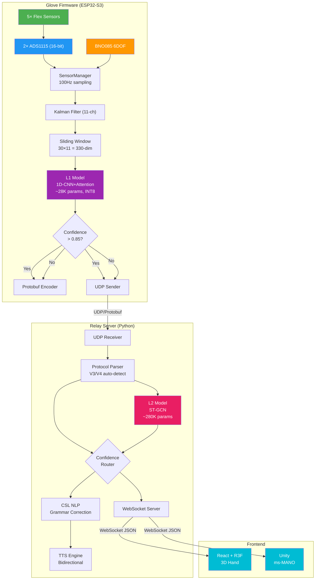
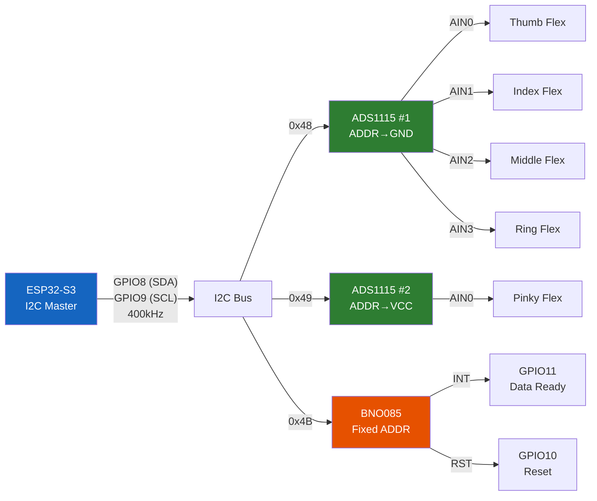
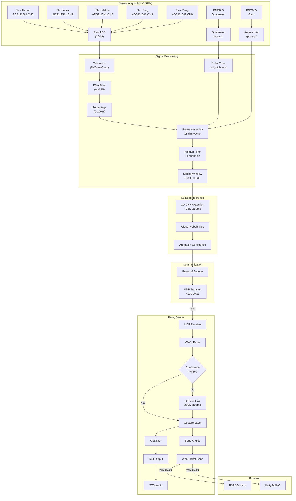
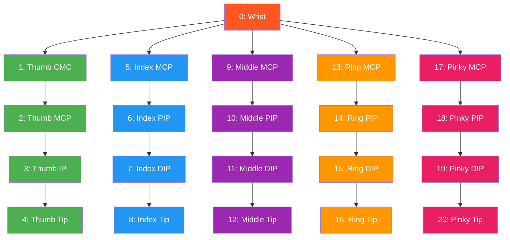
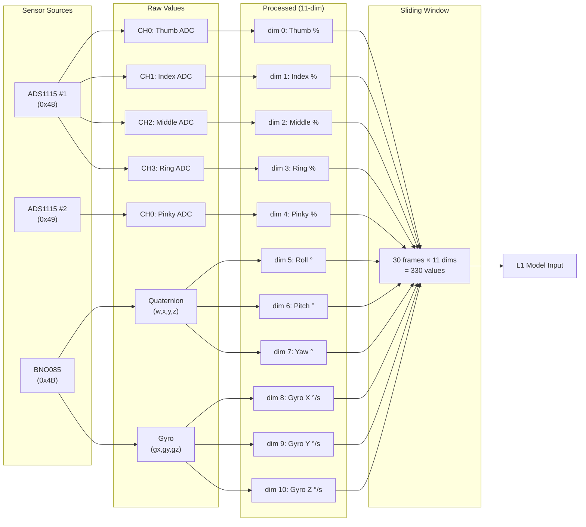

# EchoGlove V4 Architecture Document

> **Version:** 4.0  
> **Date:** 2026-06-01  
> **Status:** Active  

---

## Table of Contents

1. [System Architecture Overview](#1-system-architecture-overview)
2. [I2C Bus Topology](#2-i2c-bus-topology)
3. [Data Flow](#3-data-flow)
4. [Wiring Diagram](#4-wiring-diagram)
5. [ST-GCN Hand Skeleton Graph](#5-st-gcn-hand-skeleton-graph)
6. [Feature Vector Mapping](#6-feature-vector-mapping)
7. [Flex Sensor Voltage Divider Circuit](#7-flex-sensor-voltage-divider-circuit)
8. [GPIO Pin Allocation](#8-gpio-pin-allocation)

---

## 1. System Architecture Overview

### 1.1 Three-Subsystem Architecture



### 1.2 Layer Stack

| Layer | Component | Technology | Location |
|---|---|---|---|
| **Physical** | Flex sensors, BNO085 | Analog + I2C | Glove PCB |
| **HAL** | ADS1115, BNO085 drivers | ESP-IDF C | `components/` |
| **Processing** | Kalman, Sliding Window | FreeRTOS tasks | `components/` |
| **Inference L1** | 1D-CNN+Attention | TFLite INT8 | ESP32-S3 |
| **Communication** | Protobuf/UDP | nanopb | `main/` |
| **Relay** | Python FastAPI | asyncio | `glove_relay/` |
| **Inference L2** | ST-GCN | PyTorch/ONNX | `glove_relay/models/` |
| **NLP/TTS** | CSL grammar, TTS | Python | `glove_relay/` |
| **Rendering** | R3F, Unity | JS/C# | `glove_web/`, `glove_unity/` |

---

## 2. I2C Bus Topology

### 2.1 Bus Diagram



### 2.2 Address Table

| Device | I2C Address | ADDR Pin Config | Role |
|---|---|---|---|
| ADS1115 #1 | 0x48 | ADDR → GND | Flex ADC (Thumb, Index, Middle, Ring) |
| ADS1115 #2 | 0x49 | ADDR → VCC | Flex ADC (Pinky, 3 spare) |
| BNO085 | 0x4B | Fixed | IMU (6DOF Game Rotation Vector) |

### 2.3 Bus Characteristics

| Parameter | Value | Notes |
|---|---|---|
| Clock speed | 400kHz (Fast mode) | Fallback to 100kHz if stability issues |
| Pull-up resistors | 4.7kΩ on SDA, SCL | External pull-ups recommended |
| Bus capacitance | <400pF | Short traces, <30cm total |
| Voltage | 3.3V | All devices on same rail |
| Total devices | 3 | Well within bus capacity |

### 2.4 I2C Transaction Timeline (100Hz)

```
Time (ms)  0    1    2    3    4    5    6    7    8    9   10
           |    |    |    |    |    |    |    |    |    |    |
ADS1115#1: [=== CH0-3 read ===]
ADS1115#2:                     [= CH0 =]
BNO085:                                [== Quat+Gyro ==]
Filter:                                                  [= =]
                                                            |
                                                         Next tick
```

- ADS1115 #1: 4 channels × ~0.5ms = ~2ms
- ADS1115 #2: 1 channel × ~0.5ms = ~0.5ms
- BNO085: quaternion + gyro read ~1ms
- **Total I2C time: ~3.5ms** (within 8ms budget)

---

## 3. Data Flow

### 3.1 End-to-End Data Flow



### 3.2 Data Format at Each Stage

| Stage | Format | Size | Rate |
|---|---|---|---|
| Raw ADC | int16[5] | 10 bytes | 100Hz |
| Raw Quaternion | float[4] | 16 bytes | 100Hz |
| Raw Gyro | float[3] | 12 bytes | 100Hz |
| Calibrated Flex | float[5] (0-100%) | 20 bytes | 100Hz |
| Euler Angles | float[3] (degrees) | 12 bytes | 100Hz |
| Feature Vector | float[11] | 44 bytes | 100Hz |
| Sliding Window | float[330] | 1320 bytes | 100Hz |
| L1 Output | float[num_classes] | 800 bytes | 100Hz |
| Protobuf Packet | bytes | ~100 bytes | 100Hz |
| WebSocket JSON | string | ~500 bytes | 100Hz |

---

## 4. Wiring Diagram

### 4.1 Complete Wiring Diagram (ASCII Art)

```
┌─────────────────────────────────────────────────────────────────────────────┐
│                           ESP32-S3-WROOM-1                                  │
│                                                                             │
│  ┌─────────┐    ┌─────────┐    ┌─────────┐    ┌─────────┐                  │
│  │ GPIO8   │    │ GPIO9   │    │ GPIO10  │    │ GPIO11  │                  │
│  │ (SDA)   │    │ (SCL)   │    │ (RST)   │    │ (INT)   │                  │
│  └────┬────┘    └────┬────┘    └────┬────┘    └────┬────┘                  │
│       │              │              │              │                        │
│  ┌────┴────┐    ┌────┴────┐    ┌────┴────┐    ┌────┴────┐                  │
│  │ GPIO12  │    │ GPIO13  │    │ GPIO47  │    │ 3.3V    │                  │
│  │ (LED)   │    │ (BTN)   │    │ (PWR)   │    │         │                  │
│  └────┬────┘    └────┬────┘    └────┬────┘    └────┬────┘                  │
│       │              │              │              │                        │
└───────┼──────────────┼──────────────┼──────────────┼────────────────────────┘
        │              │              │              │
        │              │              │              │
        ▼              ▼              ▼              ▼
   ┌─────────┐   ┌─────────┐   ┌─────────┐   ┌─────────────────────────────┐
   │ WS2812B │   │ Button  │   │ MOSFET  │   │        I2C Bus              │
   │ Status  │   │ Calibr. │   │ Power   │   │                             │
   │ LED     │   │         │   │ Switch  │   │  SDA (GPIO8) ────┬────┬─── │
   └─────────┘   └─────────┘   └─────────┘   │  SCL (GPIO9) ──┬┼────┼─── │
                                              │                 ││    │    │
                                              │   4.7kΩ pull-ups││    │    │
                                              │   SDA─3.3V      ││    │    │
                                              │   SCL─3.3V       ││    │    │
                                              └─────────────────┼┼────┼────┘
                                                                ││    │
                        ┌───────────────────────────────────────┘│    │
                        │                                        │    │
                        ▼                                        ▼    │
               ┌─────────────────┐                      ┌─────────────────┐
               │  ADS1115 #1     │                      │  ADS1115 #2     │
               │  ADDR: 0x48     │                      │  ADDR: 0x49     │
               │                 │                      │                 │
               │  VDD ─── 3.3V  │                      │  VDD ─── 3.3V  │
               │  GND ─── GND   │                      │  GND ─── GND   │
               │  SDA ─── GPIO8 │                      │  SDA ─── GPIO8 │
               │  SCL ─── GPIO9 │                      │  SCL ─── GPIO9 │
               │  ADDR ── GND   │                      │  ADDR ── VCC   │
               │                 │                      │                 │
               │  AIN0 ──┬──    │                      │  AIN0 ──┬──    │
               │  AIN1 ──┼──    │                      │  AIN1 ──┼── (spare)
               │  AIN2 ──┼──    │                      │  AIN2 ──┼── (spare)
               │  AIN3 ──┼──    │                      │  AIN3 ──┼── (spare)
               └────┬────┼──────┘                      └────┬────┼──────┘
                    │    │                                  │    │
                    │    │                                  │    │
                    ▼    ▼                                  ▼    ▼
               ┌──────────────────────────────────────────────────────┐
               │              Flex Sensor Voltage Dividers            │
               │                                                      │
               │  3.3V ──[47kΩ]──┬── AIN0 (Thumb)   [Flex] ── GND   │
               │  3.3V ──[47kΩ]──┬── AIN1 (Index)   [Flex] ── GND   │
               │  3.3V ──[47kΩ]──┬── AIN2 (Middle)  [Flex] ── GND   │
               │  3.3V ──[47kΩ]──┬── AIN3 (Ring)    [Flex] ── GND   │
               │  3.3V ──[47kΩ]──┬── AIN0 (Pinky)   [Flex] ── GND   │
               │                                                      │
               └──────────────────────────────────────────────────────┘

                                              ┌─────────────────┐
                                              │  BNO085         │
                                              │  ADDR: 0x4B     │
                                              │                 │
                                              │  VCC ─── 3.3V  │
                                              │  GND ─── GND   │
                                              │  SDA ─── GPIO8 │
                                              │  SCL ─── GPIO9 │
                                              │  RST ─── GPIO10│
                                              │  INT ─── GPIO11│
                                              └─────────────────┘
```

### 4.2 Physical Layout (Glove)

```
        Dorsal (Back) View of Right Hand
        
             ┌───┐
             │BNO│  ← BNO085 on back of hand
             │085│
             └─┬─┘
    ┌──────────┼──────────┐
    │          │          │
    │    ┌─────┴─────┐    │
    │    │  ESP32-S3  │    │
    │    │  + ADS1115 │    │
    │    │  (back PCB)│    │
    │    └───────────┘    │
    │                     │
    │  Flex sensors run   │
    │  along each finger  │
    │  on dorsal side     │
    │                     │
    │  ┌──┐ ┌──┐ ┌──┐ ┌──┐ ┌──┐
    │  │T │ │I │ │M │ │R │ │P │  ← Flex sensors
    │  │h │ │n │ │i │ │i │ │i │    (one per finger)
    │  │u │ │d │ │d │ │n │ │n │
    │  │m │ │e │ │d │ │g │ │k │
    │  │b │ │x │ │l │ │  │ │y │
    │  │  │ │  │ │e │ │  │ │  │
    │  └──┘ └──┘ └──┘ └──┘ └──┘
    └─────────────────────────────┘
```

---

## 5. ST-GCN Hand Skeleton Graph

### 5.1 21-Node Hand Skeleton



### 5.2 Adjacency Matrix (Edge List)

```
Edges: (parent → child)
(0,1), (1,2), (2,3), (3,4)        — Thumb
(0,5), (5,6), (6,7), (7,8)        — Index
(0,9), (9,10), (10,11), (11,12)   — Middle
(0,13), (13,14), (14,15), (15,16) — Ring
(0,17), (17,18), (18,19), (19,20) — Pinky
```

### 5.3 Flex-to-Skeleton Mapping

| Flex Sensor | Node (Direct) | Nodes (Kinematic) |
|---|---|---|
| Thumb (0) | 1 (CMC) | 1→2→3 (CMC, MCP, IP) |
| Index (1) | 5 (MCP) | 5→6→7 (MCP, PIP, DIP) |
| Middle (2) | 9 (MCP) | 9→10→11 (MCP, PIP, DIP) |
| Ring (3) | 13 (MCP) | 13→14→15 (MCP, PIP, DIP) |
| Pinky (4) | 17 (MCP) | 17→18→19 (MCP, PIP, DIP) |
| IMU Euler | 0 (Wrist) | — |

---

## 6. Feature Vector Mapping

### 6.1 11-Dimensional Feature Vector



### 6.2 Value Ranges

| Dim | Channel | Unit | Min | Max | Typical Range |
|---|---|---|---|---|---|
| 0 | Thumb flex | % | 0 | 100 | 0–85 |
| 1 | Index flex | % | 0 | 100 | 0–90 |
| 2 | Middle flex | % | 0 | 100 | 0–90 |
| 3 | Ring flex | % | 0 | 100 | 0–85 |
| 4 | Pinky flex | % | 0 | 100 | 0–80 |
| 5 | Roll | degrees | -180 | +180 | -45 to +45 |
| 6 | Pitch | degrees | -90 | +90 | -30 to +30 |
| 7 | Yaw | degrees | -180 | +180 | -90 to +90 |
| 8 | Gyro X | °/s | -2000 | +2000 | -500 to +500 |
| 9 | Gyro Y | °/s | -2000 | +2000 | -500 to +500 |
| 10 | Gyro Z | °/s | -2000 | +2000 | -500 to +500 |

---

## 7. Flex Sensor Voltage Divider Circuit

### 7.1 Circuit Schematic (ASCII)

```
                    VCC (3.3V)
                        │
                        │
                   ┌────┴────┐
                   │ R_fixed │
                   │  47kΩ   │
                   │  ±1%    │
                   └────┬────┘
                        │
                        ├─────────────────── To ADS1115 AINx
                        │                    (Analog Input)
                        │
                   ┌────┴────┐
                   │  Flex   │
                   │ Sensor  │
                   │ 25-125kΩ│
                   │ (bend)  │
                   └────┬────┘
                        │
                        │
                       GND

    Optional: 100nF capacitor from AINx to GND (noise filter)
```

### 7.2 Transfer Function

```
V_out = VCC × R_flex / (R_fixed + R_flex)

Where:
  R_flex(unbent)  ≈ 25kΩ   → V_out = 3.3 × 25/(47+25) = 1.146V
  R_flex(45°)     ≈ 50kΩ   → V_out = 3.3 × 50/(47+50) = 1.701V
  R_flex(90°)     ≈ 125kΩ  → V_out = 3.3 × 125/(47+125) = 2.401V

ADC counts (16-bit, PGA ±4.096V, LSB = 125µV):
  Unbent:  1.146V / 125µV = 9,168 counts
  45°:     1.701V / 125µV = 13,608 counts
  90°:     2.401V / 125µV = 19,208 counts

Dynamic range: 19,208 - 9,168 = 10,040 counts (153 counts/degree)
```

### 7.3 Noise Analysis

| Source | Contribution | Mitigation |
|---|---|---|
| ADS1115 quantization | 1 LSB = 125µV | 16-bit resolution sufficient |
| ADS1115 noise | ~4µVrms (860 SPS) | Negligible |
| Flex sensor noise | ~0.5% of reading | EMA filter (α=0.15) |
| Power supply ripple | ~1mV | 100nF decoupling cap |
| I2C crosstalk | ~100µV | Short traces, ground plane |
| **Total noise** | **~0.3% of reading** | **~30 counts** |

---

## 8. GPIO Pin Allocation

### 8.1 Complete Pin Map

| GPIO | Function | Direction | Connected To | Pull | Notes |
|---|---|---|---|---|---|
| 0 | Boot button | Input | Boot button | Pull-up | Boot mode select |
| 1 | UART0 TX | Output | USB-UART | — | Debug serial |
| 3 | UART0 RX | Input | USB-UART | — | Debug serial |
| 8 | I2C0 SDA | Bidirectional | ADS1115×2, BNO085 | 4.7kΩ pull-up | I2C data |
| 9 | I2C0 SCL | Output | ADS1115×2, BNO085 | 4.7kΩ pull-up | I2C clock |
| 10 | BNO085 RST | Output | BNO085 RST | 10kΩ pull-up | Active low reset |
| 11 | BNO085 INT | Input | BNO085 INT | — | Data ready (rising edge) |
| 12 | Status LED | Output | WS2812B DIN | — | System status |
| 13 | Cal button | Input | Tactile button | 10kΩ pull-up | Active low, calibration |
| 14 | Reserved | — | — | — | Future expansion |
| 15 | Reserved | — | — | — | Future expansion |
| 16 | Reserved | — | — | — | Future expansion |
| 17 | Reserved | — | — | — | Future expansion |
| 18 | USB D- | Bidirectional | USB connector | — | Native USB |
| 19 | USB D+ | Bidirectional | USB connector | — | Native USB |
| 20 | Reserved | — | — | — | Future expansion |
| 21 | Reserved | — | — | — | Future expansion |
| 47 | Flex power | Output | MOSFET gate | — | Flex sensor power switch |
| 48 | Neopixel | Output | Onboard LED | — | ESP32-S3 devkit LED |

### 8.2 I2C Pin Configuration

```c
#define I2C_MASTER_SCL_IO           9       // GPIO9
#define I2C_MASTER_SDA_IO           8       // GPIO8
#define I2C_MASTER_NUM              0       // I2C port 0
#define I2C_MASTER_FREQ_HZ          400000  // 400kHz
#define I2C_MASTER_TX_BUF_DISABLE   0
#define I2C_MASTER_RX_BUF_DISABLE   0
#define I2C_MASTER_TIMEOUT_MS       100
```

### 8.3 Power Budget

| Component | Voltage | Current (typ) | Current (max) | Power |
|---|---|---|---|---|
| ESP32-S3 (active) | 3.3V | 80mA | 350mA | 264mW |
| BNO085 | 3.3V | 12mA | 15mA | 40mW |
| ADS1115 #1 | 3.3V | 0.15mA | 0.3mA | 0.5mW |
| ADS1115 #2 | 3.3V | 0.15mA | 0.3mA | 0.5mW |
| Flex dividers (5×) | 3.3V | 0.07mA each | 0.35mA total | 1.2mW |
| WS2812B LED | 3.3V | 1mA | 60mA | 3.3mW |
| **Total** | | **~94mA** | **~426mA** | **~310mW** |

**Battery life estimate (500mAh LiPo):**
- Typical: 500mAh / 94mA = **5.3 hours**
- Worst case: 500mAh / 426mA = **1.2 hours**

---

*End of Architecture Document*
