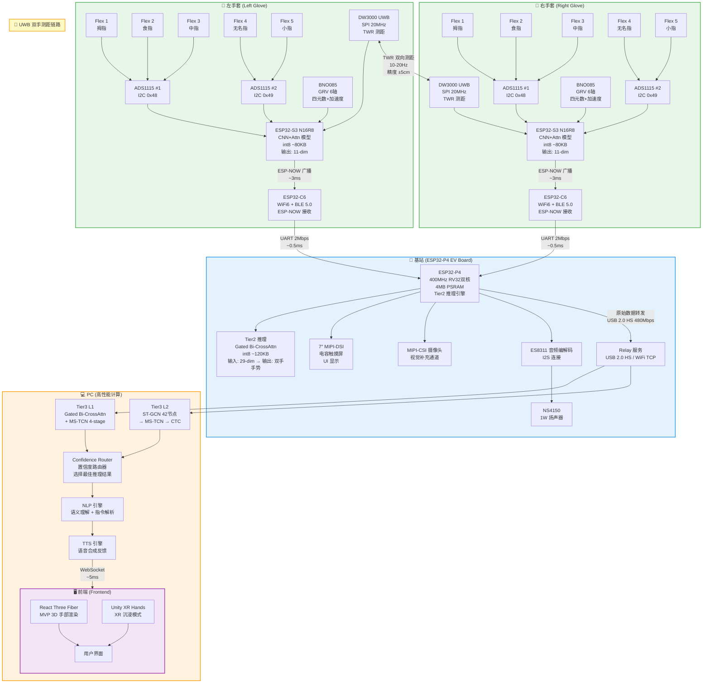
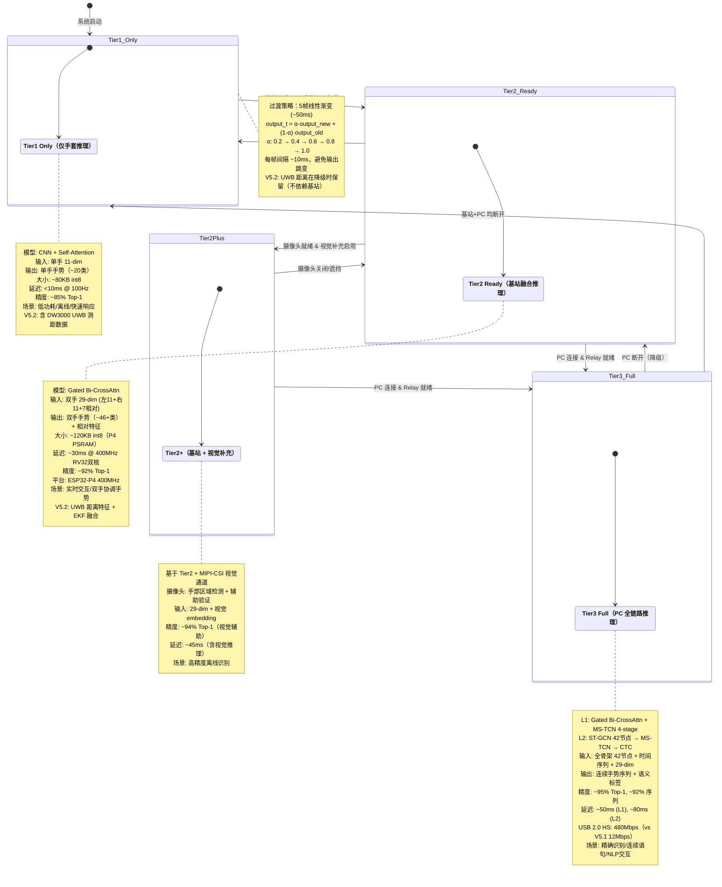
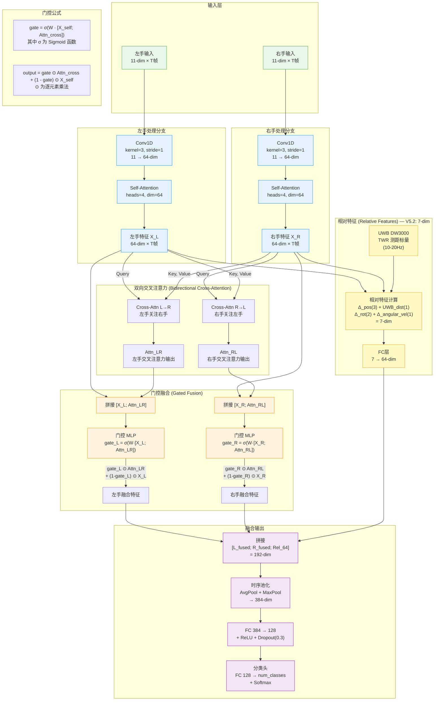
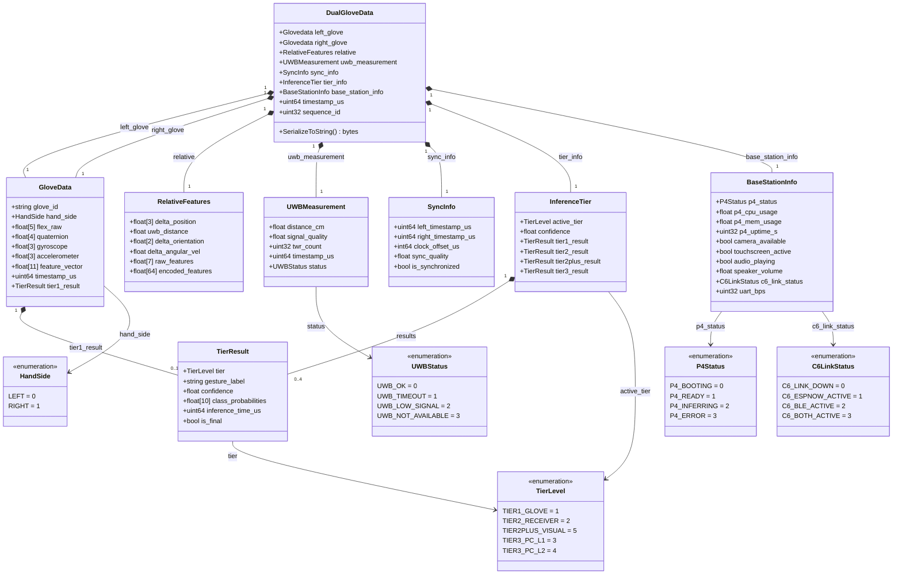
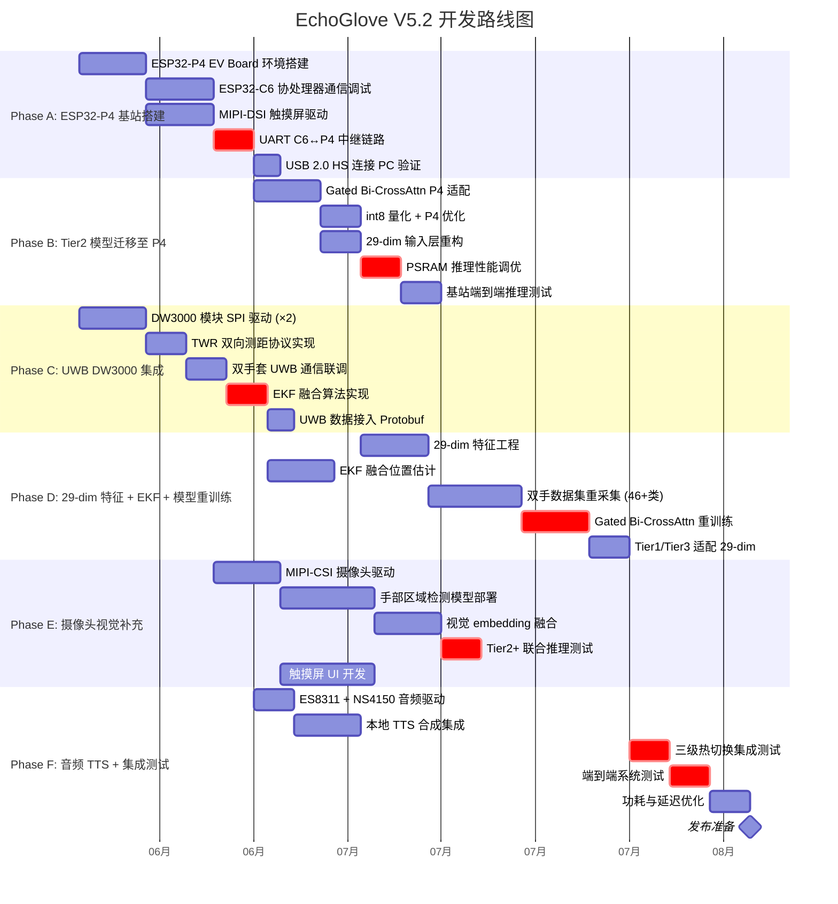

# EchoGlove V5.2 — 完整架构图集

> 生成日期：2026-06-03
> 本文档包含 EchoGlove V5.2 系统的全部核心架构图，使用 Mermaid 和 ASCII art 绘制，
> 所有内容均用中文注释，可直接在支持 Mermaid 的渲染器中查看。
>
> **V5.2 关键升级（相对 V5.1）：**
> - 接收器升级为 ESP32-P4-Function-EV-Board（ESP32-P4 400MHz RV32双核 + ESP32-C6 WiFi6/BLE5 协处理器）
> - 新增 7" MIPI-DSI 触摸屏、MIPI-CSI 摄像头、ES8311 音频编解码 + NS4150 扬声器
> - 每只手套新增 DW3000 UWB 模块（SPI 连接），支持双手间精确测距
> - 特征向量从 28-dim 扩展为 29-dim（新增 UWB 距离标量）
> - 通信架构：ESP-NOW 主通道 + BLE 5.0 备份（ESP32-C6），C6→P4 UART 2Mbps 中继
> - Tier2 模型容量提升至 ~120KB，运行于 ESP32-P4 400MHz 双核 RISC-V

---

## 目录

1. [系统总架构 — 三级热切换](#1-系统总架构--三级热切换)
2. [三级热切换状态机](#2-三级热切换状态机)
3. [Gated Bidirectional CrossAttention 详细架构](#3-gated-bidirectional-crossattention-详细架构)
4. [ST-GCN 分层架构](#4-st-gcn-分层架构)
5. [L2 三阶段流水线：ST-GCN → MS-TCN → CTC](#5-l2-三阶段流水线st-gcn--ms-tcn--ctc)
6. [数据流总览](#6-数据流总览)
7. [三级推理规格对比表](#7-三级推理规格对比表)
8. [Protobuf V5.2 消息结构](#8-protobuf-v52-消息结构)
9. [Unity XR Hands 26 关节映射图](#9-unity-xr-hands-26-关节映射图)
10. [开发阶段甘特图](#10-开发阶段甘特图)

---

## 1. 系统总架构 — 三级热切换



**V5.2 关键说明：**
- 每只手套新增 DW3000 UWB 模块，通过 SPI 连接 ESP32-S3，支持 TWR 双向测距（10-20Hz，精度 ±5cm）
- 基站从 ESP32-S3 升级为 ESP32-P4-Function-EV-Board：
  - **ESP32-P4**（400MHz RV32双核，4MB PSRAM）运行 Tier2 推理，模型容量 ~120KB
  - **ESP32-C6**（WiFi6 + BLE 5.0）负责 ESP-NOW 接收，通过 UART 2Mbps 中继至 P4
  - 新增 7" MIPI-DSI 触摸屏（UI 显示/调试面板）
  - 新增 MIPI-CSI 摄像头（视觉补充通道，Tier2+）
  - 新增 ES8311 音频编解码 + NS4150 扬声器（本地 TTS 反馈）
- 特征向量从 28-dim 扩展为 **29-dim**：11×2（左右手）+ 7 相对特征（3 position + 1 UWB distance + 2 orientation + 1 angular_vel）
- 通信架构：ESP-NOW 主通道 → C6 UART 中继 → P4；BLE 5.0 作为 C6 备份通道
- P4 通过 USB 2.0 HS（480Mbps）连接 PC，比 V5.1 的 USB FS（12Mbps）提升 40× 带宽

---

## 2. 三级热切换状态机



**V5.2 状态机变更说明：**
- 新增 **Tier2+** 状态：当 MIPI-CSI 摄像头可用时启用视觉补充通道
- Tier2 输入从 22-dim 升级为 29-dim（新增 7-dim 相对特征含 UWB 距离）
- Tier2 延迟从 ~15ms（ESP32-S3 240MHz）变为 ~30ms（ESP32-P4 400MHz），但模型更大（~120KB vs ~80KB），精度提升至 ~92%
- 降级时 UWB 测距功能保留在手套端（DW3000 间直连），不受基站状态影响

---

## 3. Gated Bidirectional CrossAttention 详细架构



**V5.2 门控机制数学表达：**
- `gate = σ(W · [X_self; Attn_cross])` — σ 为 Sigmoid，W 为可学习参数
- `output = gate ⊙ Attn_cross + (1 - gate) ⊙ X_self` — 当 gate≈1 时更依赖交叉注意力，gate≈0 时保留自身特征

**V5.2 相对特征详解（7-dim，较 V5.1 的 6-dim 新增 UWB 距离）：**

| 维度索引 | 特征名称 | 来源 | 说明 |
|---------|---------|------|------|
| 0-2 | Δ_position (3-dim) | BNO085 + EKF | 左右手腕部相对位置（经 EKF 融合 IMU + UWB） |
| 3 | UWB_distance (1-dim) | DW3000 TWR | 双手间 UWB 测距标量（10-20Hz，±5cm） |
| 4-5 | Δ_orientation (2-dim) | BNO085 四元数 | 左右手相对朝向（偏航+俯仰，省略翻滚） |
| 6 | Δ_angular_vel (1-dim) | BNO085 陀螺仪 | 左右手角速度差异标量 |

**29-dim 总特征向量分解：**
- 左手 11-dim：5 Flex + 3 gyro + 3 accel
- 右手 11-dim：5 Flex + 3 gyro + 3 accel
- 相对 7-dim：3 Δ_pos + 1 UWB_dist + 2 Δ_orient + 1 Δ_ang_vel
- **总计：11 + 11 + 7 = 29-dim**

---

## 4. ST-GCN 分层架构

### 4.1 Tier1/2: 12 节点骨架（精简版）

```
┌─────────────────────────────────────────────────────────────────┐
│                ST-GCN Tier1/2: 12 节点骨架                       │
│                28 条边 = 10(内部) + 6(跨手) + 12(自环)            │
├─────────────────────────────────────────────────────────────────┤
│                                                                 │
│   左手 (Left)                      右手 (Right)                 │
│   ┌──────────┐                     ┌──────────┐                │
│   │          │                     │          │                │
│   │  L_thumb  ←──── 自环 ────→     │  R_thumb  │                │
│   │  L_index  ←──── 自环 ────→     │  R_index  │                │
│   │  L_middle ←──── 自环 ────→     │  R_middle │                │
│   │  L_ring   ←──── 自环 ────→     │  R_ring   │                │
│   │  L_pinky  ←──── 自环 ────→     │  R_pinky  │                │
│   │  L_wrist  ←──── 自环 ────→     │  R_wrist  │                │
│   │          │                     │          │                │
│   └──────────┘                     └──────────┘                │
│                                                                 │
│   节点编号 (Node ID):                                           │
│   ┌─────┬─────┬─────┬─────┬─────┬─────┬─────┬─────┬─────┬─────┬─────┬─────┐
│   │  0  │  1  │  2  │  3  │  4  │  5  │  6  │  7  │  8  │  9  │ 10  │ 11  │
│   ├─────┼─────┼─────┼─────┼─────┼─────┼─────┼─────┼─────┼─────┼─────┼─────┤
│   │L_拇 │L_食 │L_中 │L_无 │L_小 │L_腕 │R_拇 │R_食 │R_中 │R_无 │R_小 │R_腕 │
│   └─────┴─────┴─────┴─────┴─────┴─────┴─────┴─────┴─────┴─────┴─────┴─────┘
│                                                                 │
│   内部边 (Intra-hand Edges, 10条):                              │
│   左手: L_thumb↔L_wrist, L_index↔L_wrist, L_middle↔L_wrist,   │
│         L_ring↔L_wrist, L_pinky↔L_wrist                       │
│   右手: R_thumb↔R_wrist, R_index↔R_wrist, R_middle↔R_wrist,   │
│         R_ring↔R_wrist, R_pinky↔R_wrist                       │
│                                                                 │
│   跨手边 (Cross-hand Edges, 6条):                               │
│   L_thumb↔R_thumb, L_index↔R_index, L_middle↔R_middle,       │
│   L_ring↔R_ring, L_pinky↔R_pinky, L_wrist↔R_wrist            │
│                                                                 │
│   自环边 (Self-loops, 每个节点各1条):                             │
│   L_thumb→L_thumb, L_index→L_index, ..., R_wrist→R_wrist      │
│   共 12 条自环边                                                │
│                                                                 │
│   ★ V5.2 节点特征 (每节点):                                      │
│   Tier1: 11-dim (5 Flex + 3 gyro + 3 accel)                    │
│   Tier2: 29-dim = 11(L) + 11(R) + 7(相对特征含UWB距离)         │
│                                                                 │
│   ★ V5.2 新增: L_wrist↔R_wrist 跨手边                          │
│   权重受 UWB 测距距离调制:                                       │
│   w_cross = exp(-d_uwb / d_ref), d_ref=30cm                    │
│                                                                 │
│   总边数 = 10(内部) + 6(跨手) + 12(自环) = 28条                 │
└─────────────────────────────────────────────────────────────────┘
```

### 4.2 Tier3: 42 节点骨架（完整版）

```
┌──────────────────────────────────────────────────────────────────────────┐
│                ST-GCN Tier3: 42 节点骨架                                  │
│                88 条边 = 40(内部) + 6(跨手) + 42(自环)                     │
├──────────────────────────────────────────────────────────────────────────┤
│                                                                          │
│   左手 21 节点 (Left Hand):                右手 21 节点 (Right Hand):     │
│   ┌────────────────────────┐               ┌────────────────────────┐    │
│   │ 拇指 (Thumb):          │               │ 拇指 (Thumb):          │    │
│   │  L0: CMC (腕掌关节)    │               │  R0: CMC (腕掌关节)    │    │
│   │  L1: MCP (掌指关节)    │               │  R1: MCP (掌指关节)    │    │
│   │  L2: PIP (近端指间)    │               │  R2: PIP (近端指间)    │    │
│   │  L3: DIP (远端指间)    │               │  R3: DIP (远端指间)    │    │
│   │ 食指 (Index):          │               │ 食指 (Index):          │    │
│   │  L4: MCP               │               │  R4: MCP               │    │
│   │  L5: PIP               │               │  R5: PIP               │    │
│   │  L6: DIP               │               │  R6: DIP               │    │
│   │ 中指 (Middle):         │               │ 中指 (Middle):         │    │
│   │  L7: MCP               │               │  R7: MCP               │    │
│   │  L8: PIP               │               │  R8: PIP               │    │
│   │  L9: DIP               │               │  R9: DIP               │    │
│   │ 无名指 (Ring):         │               │ 无名指 (Ring):         │    │
│   │  L10: MCP              │               │  R10: MCP              │    │
│   │  L11: PIP              │               │  R11: PIP              │    │
│   │  L12: DIP              │               │  R12: DIP              │    │
│   │ 小指 (Pinky):          │               │ 小指 (Pinky):          │    │
│   │  L13: MCP              │               │  R13: MCP              │    │
│   │  L14: PIP              │               │  R14: PIP              │    │
│   │  L15: DIP              │               │  R15: DIP              │    │
│   │ 手掌 (Palm):           │               │ 手掌 (Palm):           │    │
│   │  L16: WRIST (腕中心)   │               │  R16: WRIST (腕中心)   │    │
│   │  L17: PALM_MID (掌心)  │               │  R17: PALM_MID (掌心)  │    │
│   │  L18: THUMB_BASE       │               │  R18: THUMB_BASE       │    │
│   │  L19: INDEX_BASE       │               │  R19: INDEX_BASE       │    │
│   │  L20: PINKY_BASE       │               │  R20: PINKY_BASE       │    │
│   └────────────────────────┘               └────────────────────────┘    │
│                                                                          │
│   内部边 (每手 20条，共 40条):                                             │
│   每根手指: MCP→PIP→DIP (链式)，拇指额外: CMC→MCP                        │
│   掌心连接: WRIST→各 MCP, PALM_MID→各 MCP                                │
│   拇指特殊: THUMB_BASE→CMC, THUMB_BASE→MCP (双自由度)                     │
│                                                                          │
│   跨手边 (6条):                                                           │
│   L_thumb↔R_thumb, L_index↔R_index, L_middle↔R_middle,                  │
│   L_ring↔R_ring, L_pinky↔R_pinky, L_wrist↔R_wrist                       │
│                                                                          │
│   ★ V5.2 跨手边权重调制:                                                  │
│   w_cross(i,j) = exp(-d_uwb / d_ref) × base_weight                     │
│   d_uwb: DW3000 实测距离, d_ref=30cm                                     │
│   双手靠近时跨手连接增强，远离时减弱                                       │
│                                                                          │
│   自环边 (每个节点 1条, 共 42条):                                          │
│   L0→L0, L1→L1, ... L20→L20, R0→R0, R1→R1, ... R20→R20                  │
│                                                                          │
│   总边数 = 40(内部) + 6(跨手) + 42(自环) = 88条                           │
└──────────────────────────────────────────────────────────────────────────┘
```

---

## 5. L2 三阶段流水线：ST-GCN → MS-TCN → CTC

```mermaid
flowchart LR
    subgraph Stage1["阶段1: 空间特征提取 (Spatial)"]
        direction TB
        IN["输入<br/>42节点 × T帧<br/>每节点 3D 坐标<br/>+ 29-dim 特征向量"] --> NORM["归一化<br/>骨骼长度标准化<br/>+ UWB 距离归一化"]
        NORM --> STGCN["ST-GCN 网络<br/>6 层 GCN Block<br/>每层: GraphConv + TCN + ReLU<br/>V5.2: 跨手边 UWB 调制"]
        STGCN --> SPATIAL_OUT["空间输出<br/>每帧 64-dim 向量"]
    end

    subgraph Stage2["阶段2: 时序精炼 (Temporal)"]
        direction TB
        SPATIAL_OUT --> MS1["MS-TCN Stage 1<br/>dilation=1,2,4<br/>粗粒度时序建模"]
        MS1 --> MS2["MS-TCN Stage 2<br/>dilation=1,2,4<br/>中粒度精炼"]
        MS2 --> MS3["MS-TCN Stage 3<br/>dilation=1,2,4<br/>细粒度精炼"]
        MS3 --> MS4["MS-TCN Stage 4<br/>dilation=1,2,4<br/>最终精炼"]
        MS4 --> TEMPORAL_OUT["时序输出<br/>每帧 class_logits"]
    end

    subgraph Stage3["阶段3: 解码 (Decoding)"]
        direction TB
        TEMPORAL_OUT --> CTC["CTC Loss 训练<br/>空白符对齐"]
        CTC --> BEAM["Beam Search 解码<br/>beam_width=10"]
        BEAM --> MERGE["重复合并<br/>去除连续重复标签"]
        MERGE --> SEQ_OUT["输出: 连续手势序列<br/>置信度 + 时间戳"]
    end

    Stage1 --> Stage2 --> Stage3

    classDef stageStyle fill:#E3F2FD,stroke:#2196F3,stroke-width:2px
    classDef outStyle fill:#E8F5E9,stroke:#4CAF50,stroke-width:2px

    class STGCN,MS1,MS2,MS3,MS4 stageStyle
    class SPATIAL_OUT,TEMPORAL_OUT,SEQ_OUT outStyle
```



**V5.2 关键参数更新：**
- ST-GCN: 6 层 GCN Block，每层 64 通道，残差连接；**V5.2: 跨手边权重受 UWB 距离调制**
- MS-TCN: 4 Stage，每 Stage 4 层 dilated Conv1D（dilation 1,2,4,8），1×1 Conv 跨 Stage 残差
- CTC: Beam Search 宽度 10，解码速度 ~5ms/帧
- **V5.2 输入增强**: 42 节点 3D 坐标 + 29-dim 特征向量（含 UWB 距离）
- **V5.2 UWB 距离归一化**: d_normalized = d_uwb / d_max, d_max = 200cm（双手最大可测距离）

---

## 6. 数据流总览

```
┌──────────────────────────────────────────────────────────────────────────────────────────────────┐
│                              EchoGlove V5.2 数据流总览                                             │
├──────────────────────────────────────────────────────────────────────────────────────────────────┤
│                                                                                                  │
│  ┌─────────────┐    I2C 100Hz     ┌──────────────────┐                                           │
│  │ 5× Flex     │ ────────────────→ │                  │                                           │
│  │ SpectraFlex │    ADC 值         │   ESP32-S3       │                                           │
│  │ 2.2"        │                   │   (每只手套)      │                                           │
│  └─────────────┘                   │                  │                                           │
│                                    │  ┌────────────┐  │                                           │
│  ┌─────────────┐    I2C 400Hz     │  │ Kalman 滤波 │  │                                           │
│  │ BNO085      │ ────────────────→ │  │ → 归一化    │  │                                           │
│  │ GRV 6轴     │   四元数+加速度   │  └─────┬──────┘  │                                           │
│  └─────────────┘                   │        │         │                                           │
│                                    │        ▼         │                                           │
│  ┌─────────────┐    SPI 20MHz     │  ┌────────────┐  │                                           │
│  │ DW3000 UWB  │ ────────────────→ │  │ 11-dim 特征 │  │                                           │
│  │ TWR 测距    │   距离标量        │  │ 5 Flex raw  │  │                                           │
│  │ 10-20Hz     │   (→ 相对特征)   │  │ 3 BNO gyro  │  │                                           │
│  └─────────────┘                   │  │ 3 BNO accel │  │                                           │
│                                    │  └─────┬──────┘  │                                           │
│                                    │        │         │                                           │
│                                    │        ▼         │                                           │
│                                    │  ┌────────────┐  │    ESP-NOW 广播                       │
│                                    │  │ Tier1 推理  │  │    Protobuf 编码                     │
│                                    │  │ CNN + Attn  │──┼───────────────────┐                  │
│                                    │  │ ~80KB int8  │  │    ~3ms 延迟       │                  │
│                                    │  │ 单手手势    │  │                   │                  │
│                                    │  └────────────┘  │                   │                  │
│                                    └──────────────────┘                   │                  │
│                                                                           ▼                  │
│  ┌─────────────────────────────────────────────────────────────────────────────────────┐        │
│  │  UWB TWR 测距流 (V5.2 新增)                                                          │        │
│  │                                                                                      │        │
│  │  DW3000(L) ──── TWR 双向测距 ────→ DW3000(R)                                         │        │
│  │     │  10-20Hz, ±5cm 精度      │                                                     │        │
│  │     │                           │                                                     │        │
│  │     ▼                           ▼                                                     │        │
│  │  ESP32-S3(L)                 ESP32-S3(R)                                              │        │
│  │  (距离标量 → 相对特征)      (距离标量 → 相对特征)                                      │        │
│  │                                                                                      │        │
│  │  ★ UWB 距离 + IMU 位置 → EKF 融合 → 融合 3D 位置估计                                  │        │
│  │    EKF 状态: [x, y, z, vx, vy, vz] (6维)                                             │        │
│  │    观测: UWB 距离(1D) + IMU 加速度(3D) → 融合位置(3D)                                  │        │
│  └─────────────────────────────────────────────────────────────────────────────────────┘        │
│                                                                                                  │
│                                    ┌──────────────────────────────────────────────┐              │
│                                    │       基站 (ESP32-P4 EV Board)               │              │
│                                    │                                              │              │
│                                    │  ┌────────────────────────────────────┐      │              │
│                                    │  │  ESP32-C6 协处理器                  │      │              │
│                                    │  │  WiFi6 + BLE 5.0                   │      │              │
│                                    │  │  ← ESP-NOW 接收 (主通道)            │      │              │
│                                    │  │  ← BLE 5.0 接收 (备份通道)          │      │              │
│                                    │  │  → UART 2Mbps 中继至 P4            │      │              │
│                                    │  │  附加延迟: ~0.5-1ms               │      │              │
│                                    │  └──────────────┬─────────────────────┘      │              │
│                                    │                 │                             │              │
│                                    │                 ▼                             │              │
│                                    │  ┌────────────────────────────────────┐      │              │
│                                    │  │  ESP32-P4 主处理器                  │      │              │
│                                    │  │  400MHz RV32双核 + 4MB PSRAM       │      │              │
│                                    │  │                                    │      │              │
│                                    │  │  ┌────────────┐                    │      │              │
│                                    │  │  │ 数据汇聚    │                    │      │              │
│                                    │  │  │ 时间同步    │                    │      │              │
│                                    │  │  │ EKF 融合    │                    │      │              │
│                                    │  │  │ 29-dim 拼接 │                    │      │              │
│                                    │  │  └─────┬──────┘                    │      │              │
│                                    │  │        │                            │      │              │
│                                    │  │        ▼                            │      │              │
│                                    │  │  ┌────────────┐                    │      │              │
│                                    │  │  │ Tier2 推理  │                    │      │              │
│                                    │  │  │ Gated Bi-   │                    │      │              │
│                                    │  │  │ CrossAttn   │                    │      │              │
│                                    │  │  │ ~120KB int8 │                    │      │              │
│                                    │  │  │ ~30ms 延迟  │                    │      │              │
│                                    │  │  │ 双手手势    │                    │      │              │
│                                    │  │  │ ~46+ 类     │                    │      │              │
│                                    │  │  └────────────┘                    │      │              │
│                                    │  │                                    │      │              │
│                                    │  │  ┌────────────────────────────┐    │      │              │
│                                    │  │  │ 外设接口                    │    │      │              │
│                                    │  │  │ 7″ MIPI-DSI 触摸屏 (UI)   │    │      │              │
│                                    │  │  │ MIPI-CSI 摄像头 (视觉补充) │    │      │              │
│                                    │  │  │ ES8311 + NS4150 (音频TTS) │    │      │              │
│                                    │  │  └────────────────────────────┘    │      │              │
│                                    │  └────────────────────────────────────┘      │              │
│                                    │                                              │              │
│                                    │  USB 2.0 HS 480Mbps → PC                    │              │
│                                    │  (vs V5.1 USB FS 12Mbps, 提升 40×)          │              │
│                                    └──────────────────────┬───────────────────────┘              │
│                                                           │                                      │
│                                                           ▼                                      │
│                                    ┌──────────────────────────────────────────────────┐           │
│                                    │                     PC Relay                     │           │
│                                    │                                                  │           │
│                                    │  ┌────────────────┐  ┌─────────────────────────┐ │           │
│                                    │  │ Tier3 L1       │  │ Tier3 L2                │ │           │
│                                    │  │ CrossAttn+     │  │ ST-GCN 42节点           │ │           │
│                                    │  │ MS-TCN 4-stage │  │ → MS-TCN → CTC          │ │           │
│                                    │  │ ~50ms          │  │ ~80ms                   │ │           │
│                                    │  └───────┬────────┘  └──────────┬──────────────┘ │           │
│                                    │          │                      │                │           │
│                                    │          ▼                      ▼                │           │
│                                    │  ┌─────────────────────────────────────────────┐ │           │
│                                    │  │         Confidence Router (置信度路由器)      │ │           │
│                                    │  │  选择最高置信度结果 / 多级融合               │ │           │
│                                    │  │  V5.2: 含 UWB 距离置信度权重               │ │           │
│                                    │  └─────────────────┬───────────────────────────┘ │           │
│                                    └────────────────────┼────────────────────────────┘           │
│                                                         │                                        │
│                                                         ▼                                        │
│                                    ┌──────────────────────────────────────────┐                   │
│                                    │  NLP 引擎                                │                   │
│                                    │  语义理解 → 指令解析 → 上下文管理         │                   │
│                                    └─────────────────┬────────────────────────┘                   │
│                                                      │                                           │
│                                                      ▼                                           │
│                                    ┌──────────────────────────────────────────┐                   │
│                                    │  TTS 引擎                                │                   │
│                                    │  语音合成 → 情感语调 → 流式输出           │                   │
│                                    │  V5.2: 本地 TTS → ES8311 + NS4150        │                   │
│                                    │  (基站扬声器直接播放，无需 PC)            │                   │
│                                    └─────────────────┬────────────────────────┘                   │
│                                                      │                                           │
│                                         WebSocket    │    ~5ms                                   │
│                                                      ▼                                           │
│                                    ┌──────────────────────────────────────────┐                   │
│                                    │  前端 (Frontend)                         │                   │
│                                    │  ┌──────────────┐  ┌──────────────────┐ │                   │
│                                    │  │ React Three  │  │ Unity XR Hands   │ │                   │
│                                    │  │ Fiber (MVP)  │  │ (沉浸模式)       │ │                   │
│                                    │  └──────────────┘  └──────────────────┘ │                   │
│                                    │  3D 手部渲染 + 手势可视化 + 交互反馈     │                   │
│                                    │  V5.2: UWB 距离可视化 (双手间距显示)     │                   │
│                                    └──────────────────────────────────────────┘                   │
│                                                                                                  │
└──────────────────────────────────────────────────────────────────────────────────────────────────┘
```

**V5.2 数据流新增关键路径：**

1. **UWB TWR 测距流**: DW3000(L) ↔ DW3000(R)，10-20Hz，精度 ±5cm
2. **EKF 融合流**: UWB 距离(1D) + IMU 加速度(3D) → 融合 3D 位置估计
3. **C6 UART 中继流**: ESP-NOW → ESP32-C6 → UART 2Mbps → ESP32-P4，附加延迟 ~0.5-1ms
4. **P4 本地音频流**: Tier2 结果 → 本地 TTS → ES8311 编解码 → NS4150 扬声器播放
5. **P4 视觉流**: MIPI-CSI 摄像头 → 手部检测 → 视觉 embedding → Tier2+ 融合
6. **USB 2.0 HS**: P4 → PC，480Mbps（V5.1 为 12Mbps USB FS，提升 40×）

---

## 7. 三级推理规格对比表

```
┌────────────────────────────────────────────────────────────────────────────────────────────────────┐
│                           EchoGlove V5.2 三级推理规格对比                                            │
├──────────┬──────────────────┬──────────────────┬──────────────────┬────────────────────────────────┤
│ 维度      │ Tier1 (手套)     │ Tier2 (基站P4)   │ Tier2+ (视觉)    │ Tier3 (PC)                     │
├──────────┼──────────────────┼──────────────────┼──────────────────┼────────────────────────────────┤
│ 平台      │ ESP32-S3         │ ESP32-P4         │ ESP32-P4         │ PC (x86/GPU)                   │
│          │ 240MHz Xtensa    │ 400MHz RV32双核  │ + MIPI-CSI 摄像头│                                │
│          │ N16R8            │ 4MB PSRAM        │                  │                                │
├──────────┼──────────────────┼──────────────────┼──────────────────┼────────────────────────────────┤
│ 模型      │ CNN + Self-Attn  │ Gated Bi-        │ Gated Bi-        │ L1: CrossAttn + MS-TCN 4-stage│
│          │                  │ CrossAttn         │ CrossAttn        │ L2: ST-GCN + MS-TCN + CTC     │
│          │                  │                  │ + Visual Emb     │                                │
├──────────┼──────────────────┼──────────────────┼──────────────────┼────────────────────────────────┤
│ 输入      │ 单手 11-dim      │ 双手 29-dim      │ 29-dim +         │ 全骨架 42节点 × T帧            │
│          │ × T帧 (100Hz)    │ (左11+右11+相对7) │ 视觉 embedding   │ + 29-dim 特征                  │
│          │                  │ × T帧 (100Hz)    │                  │ (骨骼坐标+时间序列+UWB)        │
├──────────┼──────────────────┼──────────────────┼──────────────────┼────────────────────────────────┤
│ 输出      │ 单手手势         │ 双手手势          │ 双手手势          │ 连续手势序列 + 语义标签         │
│          │ (~20 类)         │ + 相对特征        │ + 视觉辅助验证    │ (无限词汇)                     │
│          │                  │ (~46+ 类)         │ (~46+ 类,更高精度)│                                │
├──────────┼──────────────────┼──────────────────┼──────────────────┼────────────────────────────────┤
│ 模型大小  │ ~80 KB (int8)    │ ~120 KB (int8)   │ ~120KB + ~50KB   │ L1: ~2 MB, L2: ~5 MB          │
│          │                  │ (P4 PSRAM充足)    │ (视觉子模型)      │                                │
├──────────┼──────────────────┼──────────────────┼──────────────────┼────────────────────────────────┤
│ 推理延迟  │ < 10 ms          │ ~ 30 ms          │ ~ 45 ms          │ L1: ~50 ms, L2: ~80 ms        │
│          │ @ 100Hz          │ @ 400MHz RV32    │ (含视觉推理)      │                                │
├──────────┼──────────────────┼──────────────────┼──────────────────┼────────────────────────────────┤
│ 精度      │ ~85% Top-1       │ ~92% Top-1       │ ~94% Top-1       │ L1: ~93% Top-1                 │
│          │                  │ (UWB距离+更大模型) │ (视觉辅助)        │ L2: ~95% Top-1, ~92% 序列      │
├──────────┼──────────────────┼──────────────────┼──────────────────┼────────────────────────────────┤
│ 功耗      │ ~50 mW           │ ~200 mW          │ ~350 mW          │ N/A (PC 供电)                  │
│          │                  │ (P4+PSRAM+C6)    │ (+摄像头背光)     │                                │
├──────────┼──────────────────┼──────────────────┼──────────────────┼────────────────────────────────┤
│ 连接依赖  │ 无（独立运行）    │ ESP-NOW → C6     │ ESP-NOW → C6     │ USB 2.0 HS / WiFi + PC        │
│          │                  │ → UART → P4      │ → UART → P4      │                                │
│          │                  │ BLE 5.0 备份      │ + 摄像头          │                                │
├──────────┼──────────────────┼──────────────────┼──────────────────┼────────────────────────────────┤
│ 特殊能力  │ UWB 测距发起     │ EKF 融合         │ 手部区域检测      │ NLP 语义理解                   │
│          │ Tier1 单手推理    │ 29-dim 双手融合   │ 视觉手势验证      │ CTC 连续序列                   │
│          │                  │ 本地 TTS 播放     │ Tier2+ 增强       │ TTS 高质量语音                  │
├──────────┼──────────────────┼──────────────────┼──────────────────┼────────────────────────────────┤
│ 典型场景  │ 快速响应          │ 实时交互          │ 高精度离线识别    │ 精确识别                        │
│          │ 低功耗/离线       │ 双手协调手势      │ 视觉辅助验证      │ 连续语句/NLP 交互               │
│          │ 单手简单手势      │ 不需 PC           │ 不需 PC          │ 沉浸式 XR 应用                  │
└──────────┴──────────────────┴──────────────────┴──────────────────┴────────────────────────────────┘
```

**V5.2 对比 V5.1 关键变化：**

| 对比项 | V5.1 | V5.2 | 变化说明 |
|--------|------|------|----------|
| Tier2 平台 | ESP32-S3 240MHz | ESP32-P4 400MHz RV32双核 | 算力提升 ~1.7×，模型更大 |
| Tier2 模型 | ~80KB | ~120KB | 更大模型容量，PSRAM 充足 |
| Tier2 延迟 | ~15ms | ~30ms | 延迟增加但精度显著提升 |
| Tier2 精度 | ~90% | ~92% | UWB 距离特征 + 更大模型 |
| Tier2 输入 | 22-dim | 29-dim | 新增 7-dim 相对特征（含 UWB） |
| Tier2 输出 | ~50类 | ~46+类 | 手势集优化重组 |
| USB 带宽 | 12Mbps (FS) | 480Mbps (HS) | 提升 40× |
| 通信 | ESP-NOW 直连 | ESP-NOW→C6→UART→P4 | C6 协处理器中继 |
| 新增 Tier | — | Tier2+（视觉补充） | MIPI-CSI 摄像头 |
| 本地音频 | 无 | ES8311+NS4150 | 基站可直接 TTS 播放 |
| 触摸屏 | 无 | 7" MIPI-DSI | UI 显示/调试面板 |
| UWB 测距 | 无 | DW3000 × 2 | 双手精确测距 ±5cm |

---

## 8. Protobuf V5.2 消息结构



### V5.2 Protobuf 新增字段详解

**1. RelativeFeatures 更新（V5.1 → V5.2）：**

```protobuf
message RelativeFeatures {
    // V5.1 原有
    float delta_position    = 1;  // → V5.2 改为 repeated float, 3-dim
    float delta_rotation    = 2;  // → V5.2 拆分为 delta_orientation

    // V5.2 新增/修改
    repeated float delta_position   = 1;  // 3-dim: [Δx, Δy, Δz] (EKF融合后)
    float uwb_distance              = 3;  // ★ NEW: UWB TWR 测距标量 (cm)
    repeated float delta_orientation = 4; // 2-dim: [偏航差, 俯仰差]
    float delta_angular_vel         = 5;  // ★ NEW: 角速度差异标量
    repeated float raw_features     = 6;  // 7-dim 完整相对特征
    repeated float encoded_features = 7;  // 64-dim FC编码后特征
}
```

**2. UWBMeasurement 新增（V5.2）：**

```protobuf
message UWBMeasurement {
    float distance_cm     = 1;  // UWB TWR 测量距离 (cm), 精度 ±5cm
    float signal_quality  = 2;  // 信号质量 0.0-1.0
    uint32 twr_count      = 3;  // TWR 往返次数
    uint64 timestamp_us   = 4;  // 测量时间戳
    UWBStatus status      = 5;  // UWB 状态枚举
}
```

**3. BaseStationInfo 新增（V5.2）：**

```protobuf
message BaseStationInfo {
    P4Status p4_status         = 1;  // P4 处理器状态
    float p4_cpu_usage         = 2;  // CPU 使用率 0.0-1.0
    float p4_mem_usage         = 3;  // PSRAM 使用率 0.0-1.0
    uint32 p4_uptime_s         = 4;  // 运行时间 (秒)
    bool camera_available      = 5;  // MIPI-CSI 摄像头可用
    bool touchscreen_active    = 6;  // 触摸屏激活
    bool audio_playing         = 7;  // 扬声器正在播放
    float speaker_volume       = 8;  // 扬声器音量 0.0-1.0
    C6LinkStatus c6_link_status = 9; // C6 通信链路状态
    uint32 uart_bps            = 10; // C6↔P4 UART 波特率
}
```

**4. TierLevel 新增枚举值（V5.2）：**

```protobuf
enum TierLevel {
    TIER1_GLOVE       = 1;  // 手套端 CNN+Attn
    TIER2_RECEIVER    = 2;  // 基站 P4 Gated Bi-CrossAttn
    TIER3_PC_L1       = 3;  // PC L1: CrossAttn + MS-TCN
    TIER3_PC_L2       = 4;  // PC L2: ST-GCN + MS-TCN + CTC
    TIER2PLUS_VISUAL  = 5;  // ★ NEW: 基站 P4 + 视觉补充
}
```

---

## 9. Unity XR Hands 26 关节映射图

```
┌──────────────────────────────────────────────────────────────────────────────────────┐
│                     Unity XR Hands 26 关节映射 (EchoGlove V5.2)                       │
├──────────────────────────────────────────────────────────────────────────────────────┤
│                                                                                      │
│  Unity XR Hands 标准 26 关节:                                                        │
│                                                                                      │
│  每只手 26 关节 = 5指 × 4关节(MCP/PIP/DIP/Tip) + 3掌(Wrist/Palm/ThumbMetacarpal)    │
│                                                                                      │
│  ┌─────────────────────────────────────────────────────────────────────────┐          │
│  │                     左手关节树 (Right Hand 类似)                         │          │
│  │                                                                         │          │
│  │  Wrist (腕)                                                             │          │
│  │   ├── ThumbMetacarpal (拇指掌骨) ← 特殊: CMC 双自由度                   │          │
│  │   │    ├── ThumbProximal    ← MCP (Flex 1: 拇指弯曲)                    │          │
│  │   │    │    ├── ThumbDistal ← DIP                                       │          │
│  │   │    │    └── ThumbTip                                                │          │
│  │   │    └── (CMC 关节: 屈伸 + 外展内收, BNO085 辅助)                     │          │
│  │   ├── IndexProximal  (食指) ← MCP (Flex 2: 食指弯曲)                    │          │
│  │   │    ├── IndexIntermediate ← PIP                                      │          │
│  │   │    │    ├── IndexDistal   ← DIP                                     │          │
│  │   │    │    └── IndexTip                                                 │          │
│  │   ├── MiddleProximal (中指) ← MCP (Flex 3: 中指弯曲)                    │          │
│  │   │    ├── MiddleIntermediate ← PIP                                     │          │
│  │   │    │    ├── MiddleDistal   ← DIP                                    │          │
│  │   │    │    └── MiddleTip                                                │          │
│  │   ├── RingProximal   (无名指) ← MCP (Flex 4: 无名指弯曲)                │          │
│  │   │    ├── RingIntermediate ← PIP                                       │          │
│  │   │    │    ├── RingDistal   ← DIP                                      │          │
│  │   │    │    └── RingTip                                                  │          │
│  │   └── LittleProximal (小指) ← MCP (Flex 5: 小指弯曲)                    │          │
│  │        ├── LittleIntermediate ← PIP                                     │          │
│  │        │    ├── LittleDistal   ← DIP                                    │          │
│  │        │    └── LittleTip                                                │          │
│  │        └── Palm (掌心) ← 虚拟节点                                       │          │
│  └─────────────────────────────────────────────────────────────────────────┘          │
│                                                                                      │
│  ┌─────────────────────────────────────────────────────────────────────────┐          │
│  │  EchoGlove V5.2 → Unity XR Hands 映射表                                 │          │
│  ├─────────────────┬──────────────────┬────────────────────────────────────┤          │
│  │ 传感器输入       │ Unity XR 关节     │ 映射说明                          │          │
│  ├─────────────────┼──────────────────┼────────────────────────────────────┤          │
│  │ Flex 1 (拇指)   │ ThumbProximal    │ 弯曲角度 → MCP.rotation.x        │          │
│  │                 │ ThumbDistal      │ DIP ≈ 0.6 × MCP (联动估计)        │          │
│  ├─────────────────┼──────────────────┼────────────────────────────────────┤          │
│  │ Flex 2 (食指)   │ IndexProximal    │ 弯曲角度 → MCP.rotation.x        │          │
│  │                 │ IndexIntermediate│ PIP ≈ 0.8 × MCP (联动估计)        │          │
│  │                 │ IndexDistal      │ DIP ≈ 0.5 × MCP (联动估计)        │          │
│  ├─────────────────┼──────────────────┼────────────────────────────────────┤          │
│  │ Flex 3 (中指)   │ MiddleProximal   │ 同食指映射逻辑                     │          │
│  │                 │ MiddleIntermediate│                                   │          │
│  │                 │ MiddleDistal     │                                    │          │
│  ├─────────────────┼──────────────────┼────────────────────────────────────┤          │
│  │ Flex 4 (无名指) │ RingProximal     │ 同食指映射逻辑                     │          │
│  │                 │ RingIntermediate │                                    │          │
│  │                 │ RingDistal       │                                    │          │
│  ├─────────────────┼──────────────────┼────────────────────────────────────┤          │
│  │ Flex 5 (小指)   │ LittleProximal   │ 同食指映射逻辑                     │          │
│  │                 │ LittleIntermediate│                                   │          │
│  │                 │ LittleDistal     │                                    │          │
│  ├─────────────────┼──────────────────┼────────────────────────────────────┤          │
│  │ BNO085 四元数   │ Wrist            │ 四元数 → Wrist.rotation           │          │
│  │ (GRV 6轴)      │                  │ q = (w,x,y,z) → Unity 四元数      │          │
│  │                 │                  │ 坐标系变换: RH→LH (z取反)          │          │
│  ├─────────────────┼──────────────────┼────────────────────────────────────┤          │
│  │ BNO085 加速度   │ Palm             │ 加速度 → 掌心位移估计              │          │
│  │                 │                  │ (可选, 用于漂移修正)               │          │
│  ├─────────────────┼──────────────────┼────────────────────────────────────┤          │
│  │ DW3000 UWB     │ 双手间距可视化   │ ★ V5.2 新增: UWB距离→双手间距     │          │
│  │ (TWR 测距)     │ (L↔R distance)  │ 双手接近时指尖碰撞特效             │          │
│  │                 │                  │ EKF融合位置→手部位置修正           │          │
│  └─────────────────┴──────────────────┴────────────────────────────────────┘          │
│                                                                                      │
│  ┌─────────────────────────────────────────────────────────────────────────┐          │
│  │  拇指特殊处理 (CMC 双自由度)                                             │          │
│  │                                                                         │          │
│  │  CMC (Carpometacarpal) 关节有两个自由度:                                 │          │
│  │    1. 屈伸 (Flexion/Extension)  ← Flex 1 主要输出                      │          │
│  │    2. 外展内收 (Abduction/Adduction) ← BNO085 辅助推断                  │          │
│  │                                                                         │          │
│  │  映射策略:                                                              │          │
│  │    Flex1 → CMC Flexion (屈伸)                                          │          │
│  │    BNO085 gyro.y → CMC Abduction (外展) [实验性]                        │          │
│  │    ThumbProximal.rotation = CMC_rotation × Flex1_rotation               │          │
│  │                                                                         │          │
│  │  注意: Unity XR Hands 中 ThumbMetacarpal 对应 CMC,                     │          │
│  │       ThumbProximal 对应 MCP, ThumbDistal 对应 IP/DIP                  │          │
│  └─────────────────────────────────────────────────────────────────────────┘          │
│                                                                                      │
│  ┌─────────────────────────────────────────────────────────────────────────┐          │
│  │  V5.2 UWB 距离可视化 (新增)                                              │          │
│  │                                                                         │          │
│  │  UWB 测距数据在 Unity/XR 中的呈现方式:                                   │          │
│  │                                                                         │          │
│  │  1. 双手间距线条: Wrist(L) ↔ Wrist(R) 连线                              │          │
│  │     - 线条颜色随距离变化: 近(<15cm)=红, 中(15-50cm)=黄, 远(>50cm)=绿    │          │
│  │     - 线条粗细随 UWB 信号质量变化                                       │          │
│  │                                                                         │          │
│  │  2. 碰撞检测辅助: UWB 距离 < 10cm 时触发指尖碰撞特效                    │          │
│  │     - 粒子特效 + 触觉反馈                                              │          │
│  │     - 辅助 ST-GCN 跨手边权重调整                                       │          │
│  │                                                                         │          │
│  │  3. EKF 位置修正:                                                       │          │
│  │     - BNO085 漂移修正: UWB距离→约束双手相对位置                        │          │
│  │     - 每 50-100ms 更新一次 EKF 状态                                    │          │
│  │     - 位置修正平滑过渡，避免跳变                                        │          │
│  └─────────────────────────────────────────────────────────────────────────┘          │
│                                                                                      │
└──────────────────────────────────────────────────────────────────────────────────────┘
```

---

## 10. 开发阶段甘特图



**V5.2 阶段依赖关系说明：**

| 阶段 | 内容 | 时长 | 前置依赖 | 关键风险 |
|------|------|------|----------|----------|
| **Phase A** | ESP32-P4 基站搭建 | 1-2 周 | 无 | C6↔P4 UART 稳定性 |
| **Phase B** | Tier2 模型迁移至 P4 | 1-2 周 | Phase A | int8 量化精度损失 |
| **Phase C** | UWB DW3000 集成 | 1-2 周 | 无（可与 A 并行） | TWR 测距精度/稳定性 |
| **Phase D** | 29-dim 特征 + EKF + 模型重训练 | 2 周 | Phase B + C | 数据集重采集工作量 |
| **Phase E** | 摄像头视觉补充 | 2-3 周 | Phase A | 视觉模型 P4 部署性能 |
| **Phase F** | 音频 TTS + 集成测试 | 1-2 周 | Phase D | 三级热切换稳定性 |

**关键路径：** Phase A → Phase B → Phase D → Phase F

**并行策略：**
- Phase A（基站搭建）和 Phase C（UWB 集成）可完全并行
- Phase E（摄像头）可在 Phase A 完成后即开始，与 Phase B/D 并行
- Phase F 的音频部分（ES8311驱动）可与 Phase D 并行

**V5.2 vs V5.1 开发周期对比：**

| 维度 | V5.1 | V5.2 | 说明 |
|------|------|------|------|
| 总开发周期 | ~16 周 | ~10-12 周 | P4 EV Board 加速硬件开发 |
| 硬件验证 | 6 周 | 1-2 周 | EV Board 免 PCB 设计 |
| UWB 集成 | 无 | 1-2 周 | DW3000 新增模块 |
| 模型重训练 | 2 周 | 2 周 | 29-dim 特征需重采集数据 |
| 视觉补充 | 无 | 2-3 周 | 摄像头 Tier2+ |
| 音频 TTS | 无 | 1-2 周 | ES8311 + NS4150 |

---

## 附录 A: ESP32-P4-Function-EV-Board 硬件规格

```
┌──────────────────────────────────────────────────────────────────────────┐
│           ESP32-P4-Function-EV-Board 硬件规格 (V5.2 基站)                │
├──────────────────────────────────────────────────────────────────────────┤
│                                                                          │
│  主处理器: ESP32-P4                                                      │
│  ┌────────────────────────────────────────────────────────────────┐      │
│  │  架构: RISC-V 32位 (RV32IMAC)                                  │      │
│  │  核心: 双核 HP (High Performance) @ 400MHz                     │      │
│  │       + 单核 LP (Low Power) @ 40MHz                            │      │
│  │  内存: 768KB SRAM + 4MB PSRAM (对外推理关键)                    │      │
│  │  Flash: 支持外挂 SPI Flash (已焊 16MB)                         │      │
│  │  指令集: 支持 SIMD/DSP 扩展 (加速矩阵运算)                      │      │
│  └────────────────────────────────────────────────────────────────┘      │
│                                                                          │
│  协处理器: ESP32-C6                                                      │
│  ┌────────────────────────────────────────────────────────────────┐      │
│  │  架构: RISC-V 32位 (RV32IMAC)                                  │      │
│  │  核心: 单核 @ 160MHz                                           │      │
│  │  无线: WiFi 6 (802.11ax) + BLE 5.0                             │      │
│  │  功能: ESP-NOW 接收 + BLE 5.0 备份通道                          │      │
│  │  连接: UART 2Mbps 至 ESP32-P4                                  │      │
│  └────────────────────────────────────────────────────────────────┘      │
│                                                                          │
│  显示: 7″ MIPI-DSI 触摸屏                                                │
│  ┌────────────────────────────────────────────────────────────────┐      │
│  │  分辨率: 800×480 或 1024×600 (取决于模组)                       │      │
│  │  接口: MIPI-DSI (2-lane)                                       │      │
│  │  触摸: 电容式多点触控                                           │      │
│  │  用途: 调试面板 / 手势识别结果展示 / 系统状态监控               │      │
│  └────────────────────────────────────────────────────────────────┘      │
│                                                                          │
│  摄像头: MIPI-CSI 接口                                                    │
│  ┌────────────────────────────────────────────────────────────────┐      │
│  │  接口: MIPI-CSI (2-lane)                                       │      │
│  │  支持: OV 系列摄像头模组                                        │      │
│  │  分辨率: 最高 1080p @ 30fps                                     │      │
│  │  用途: 手部区域检测 / Tier2+ 视觉辅助验证                       │      │
│  │  ISP: P4 内置硬件 ISP (降噪/白平衡/边缘增强)                    │      │
│  └────────────────────────────────────────────────────────────────┘      │
│                                                                          │
│  音频: ES8311 + NS4150                                                    │
│  ┌────────────────────────────────────────────────────────────────┐      │
│  │  编解码: ES8311 (I2S 接口, 24bit/96kHz)                        │      │
│  │  功放: NS4150 (D类, 1W @ 8Ω)                                   │      │
│  │  用途: 本地 TTS 语音反馈 / 手势提示音 / 调试播报               │      │
│  │  优势: 基站可独立播放语音，无需 PC                               │      │
│  └────────────────────────────────────────────────────────────────┘      │
│                                                                          │
│  USB: USB 2.0 HS (OTG)                                                   │
│  ┌────────────────────────────────────────────────────────────────┐      │
│  │  速度: 480 Mbps (High Speed)                                   │      │
│  │  模式: CDC (虚拟串口) / MSC (大容量存储) / 自定义               │      │
│  │  对比: V5.1 ESP32-S3 USB FS = 12Mbps, 提升 40×                │      │
│  │  用途: PC 数据传输 / 固件升级 / 调试日志                        │      │
│  └────────────────────────────────────────────────────────────────┘      │
│                                                                          │
│  通信链路汇总:                                                            │
│  ┌────────────────────────────────────────────────────────────────┐      │
│  │  手套 → C6: ESP-NOW (2.4GHz, ~3ms延迟, 主通道)                │      │
│  │  手套 → C6: BLE 5.0 (备份通道, 功耗略高)                       │      │
│  │  C6 → P4: UART 2Mbps (~0.5-1ms 附加延迟)                      │      │
│  │  P4 → PC: USB 2.0 HS 480Mbps (CDC/自定义协议)                 │      │
│  │  手套间: DW3000 UWB TWR (10-20Hz, ±5cm)                       │      │
│  └────────────────────────────────────────────────────────────────┘      │
│                                                                          │
└──────────────────────────────────────────────────────────────────────────┘
```

---

## 附录 B: DW3000 UWB 模块规格

```
┌──────────────────────────────────────────────────────────────────────────┐
│                    DW3000 UWB 模块规格 (V5.2 手套端)                      │
├──────────────────────────────────────────────────────────────────────────┤
│                                                                          │
│  芯片: Qorvo DW3000                                                      │
│  ┌────────────────────────────────────────────────────────────────┐      │
│  │  频段: UWB Channel 5 (6.5GHz) / Channel 9 (8.0GHz)            │      │
│  │  带宽: 500MHz (超宽带)                                         │      │
│  │  测距精度: ±5cm (典型), ±2cm (最优条件)                        │      │
│  │  测距方式: TWR (Two-Way Ranging) 双向测距                      │      │
│  │  测距频率: 10-20Hz (可配置)                                    │      │
│  │  最大测距: ~200m (开阔环境)                                    │      │
│  │  接口: SPI (最高 20MHz)                                        │      │
│  │  功耗: ~80mW (活跃测距), <1mW (休眠)                           │      │
│  │  天线: 板载 UWB 天线 (或外接)                                   │      │
│  └────────────────────────────────────────────────────────────────┘      │
│                                                                          │
│  与 ESP32-S3 连接:                                                       │
│  ┌────────────────────────────────────────────────────────────────┐      │
│  │  接口: SPI (Mode 0)                                            │      │
│  │  引脚: MOSI, MISO, SCLK, CS, IRQ                              │      │
│  │  时钟: 20MHz (ESP32-S3 SPI 主模式)                             │      │
│  │  IRQ: DW3000 → ESP32-S3 GPIO 中断 (测距完成通知)              │      │
│  │  数据流: DW3000 TWR完成 → IRQ → SPI读取距离值 → EKF融合       │      │
│  └────────────────────────────────────────────────────────────────┘      │
│                                                                          │
│  TWR 测距时序:                                                           │
│  ┌────────────────────────────────────────────────────────────────┐      │
│  │                                                                 │      │
│  │  发起方 (Initiator, 如左手)                                     │      │
│  │    │── POLL ──→                                                 │      │
│  │    │←── RESPONSE ──                                             │      │
│  │    │── FINAL ──→                                                │      │
│  │    │←── RESULT ──                                               │      │
│  │    │                                                            │      │
│  │  响应方 (Responder, 如右手)                                     │      │
│  │    │←── POLL ──                                                 │      │
│  │    │── RESPONSE ──→                                             │      │
│  │    │←── FINAL ──                                                │      │
│  │    │── RESULT ──→                                               │      │
│  │                                                                 │      │
│  │  单次 TWR 耗时: ~2-5ms (含处理)                                │      │
│  │  10Hz 模式: 每 100ms 一次测距                                   │      │
│  │  20Hz 模式: 每 50ms 一次测距                                    │      │
│  └────────────────────────────────────────────────────────────────┘      │
│                                                                          │
│  EKF 融合算法:                                                           │
│  ┌────────────────────────────────────────────────────────────────┐      │
│  │  状态向量: x = [px, py, pz, vx, vy, vz] (6维)                 │      │
│  │  预测步: 基于 IMU 加速度积分                                    │      │
│  │  更新步: UWB 距离作为观测约束                                   │      │
│  │                                                                 │      │
│  │  观测模型: z = ||p_L - p_R|| + noise                           │      │
│  │  其中 p_L, p_R 为左右手腕位置                                   │      │
│  │                                                                 │      │
│  │  创新: UWB 距离约束双手相对位置，有效抑制 IMU 漂移              │      │
│  │  频率: EKF @ 100Hz (IMU), 更新 @ 10-20Hz (UWB)                │      │
│  └────────────────────────────────────────────────────────────────┘      │
│                                                                          │
└──────────────────────────────────────────────────────────────────────────┘
```

---

## 附录 C: V5.1 → V5.2 迁移检查清单

```
┌──────────────────────────────────────────────────────────────────────────┐
│                    V5.1 → V5.2 迁移检查清单                                │
├──────────┬───────────────────────────────────────────────┬────┬──────────┤
│ 类别      │ 检查项                                        │ 必须│ 状态     │
├──────────┼───────────────────────────────────────────────┼────┼──────────┤
│ 硬件      │ ESP32-P4 EV Board 采购与验收                  │ ✓  │ □ 待完成 │
│          │ ESP32-C6 模块焊接/连接测试                     │ ✓  │ □ 待完成 │
│          │ 7″ MIPI-DSI 触摸屏点亮测试                    │ ✓  │ □ 待完成 │
│          │ MIPI-CSI 摄像头模组选型与测试                  │ ○  │ □ 待完成 │
│          │ ES8311 + NS4150 音频链路测试                   │ ✓  │ □ 待完成 │
│          │ DW3000 UWB 模块 × 2 采购                       │ ✓  │ □ 待完成 │
│          │ USB 2.0 HS 连接 PC 测试                       │ ✓  │ □ 待完成 │
├──────────┼───────────────────────────────────────────────┼────┼──────────┤
│ 固件      │ ESP32-P4 基础固件 (ESP-IDF 5.x)              │ ✓  │ □ 待完成 │
│          │ C6 ESP-NOW 接收 + UART 中继                    │ ✓  │ □ 待完成 │
│          │ C6 BLE 5.0 备份通道实现                        │ ○  │ □ 待完成 │
│          │ DW3000 SPI 驱动 + TWR 协议                     │ ✓  │ □ 待完成 │
│          │ EKF 融合算法 (IMU + UWB)                      │ ✓  │ □ 待完成 │
│          │ MIPI-DSI 显示驱动                              │ ✓  │ □ 待完成 │
│          │ MIPI-CSI 摄像头驱动                            │ ○  │ □ 待完成 │
│          │ ES8311 I2S 音频驱动                            │ ✓  │ □ 待完成 │
│          │ USB 2.0 HS CDC 实现                            │ ✓  │ □ 待完成 │
├──────────┼───────────────────────────────────────────────┼────┼──────────┤
│ 模型      │ Tier2 29-dim 输入层适配                       │ ✓  │ □ 待完成 │
│          │ 相对特征 7-dim (含 UWB) 扩展                   │ ✓  │ □ 待完成 │
│          │ Tier2 ~120KB 模型训练 + int8 量化              │ ✓  │ □ 待完成 │
│          │ P4 TFLite Micro 推理框架                       │ ✓  │ □ 待完成 │
│          │ Tier2+ 视觉子模型部署                          │ ○  │ □ 待完成 │
│          │ ST-GCN 跨手边 UWB 权重调制                     │ ○  │ □ 待完成 │
│          │ 46+ 类手势数据集采集                           │ ✓  │ □ 待完成 │
├──────────┼───────────────────────────────────────────────┼────┼──────────┤
│ 协议      │ Protobuf V5.2 消息定义更新                    │ ✓  │ □ 待完成 │
│          │ UWBMeasurement 消息集成                        │ ✓  │ □ 待完成 │
│          │ BaseStationInfo 消息集成                       │ ✓  │ □ 待完成 │
│          │ RelativeFeatures 7-dim 扩展                    │ ✓  │ □ 待完成 │
│          │ TIER2PLUS_VISUAL 枚举值                        │ ○  │ □ 待完成 │
├──────────┼───────────────────────────────────────────────┼────┼──────────┤
│ 前端      │ UWB 距离可视化 (双手间距线条)                  │ ○  │ □ 待完成 │
│          │ 碰撞检测辅助特效                               │ ○  │ □ 待完成 │
│          │ EKF 位置修正接入                               │ ○  │ □ 待完成 │
│          │ 触摸屏 UI 面板                                 │ ✓  │ □ 待完成 │
├──────────┼───────────────────────────────────────────────┼────┼──────────┤
│ 测试      │ 三级热切换回归测试                             │ ✓  │ □ 待完成 │
│          │ UWB 测距精度测试 (多环境)                      │ ✓  │ □ 待完成 │
│          │ EKF 融合精度测试                               │ ✓  │ □ 待完成 │
│          │ C6 UART 中继稳定性测试                         │ ✓  │ □ 待完成 │
│          │ 本地 TTS 音频测试                              │ ○  │ □ 待完成 │
│          │ 端到端延迟测试                                 │ ✓  │ □ 待完成 │
│          │ 功耗测试 (手套+基站)                           │ ✓  │ □ 待完成 │
└──────────┴───────────────────────────────────────────────┴────┴──────────┘

  ✓ = 必须完成   ○ = 可选/后续版本
```

---

## 附录: 版本变更记录

| 版本 | 日期 | 变更内容 |
|------|------|----------|
| V5.1-draft | 2026-06-02 | 初始版本，包含全部 10 张架构图 |
| V5.2-draft | 2026-06-03 | V5.2 重大升级：ESP32-P4 基站、DW3000 UWB、29-dim 特征、Tier2+ 视觉、音频 TTS |

### V5.2 变更摘要

**硬件变更：**
- 接收器：ESP32-S3 → ESP32-P4-Function-EV-Board（ESP32-P4 + ESP32-C6）
- 新增：7" MIPI-DSI 触摸屏、MIPI-CSI 摄像头、ES8311+NS4150 音频
- 新增：每只手套 DW3000 UWB 模块（SPI 连接）
- USB：FS 12Mbps → HS 480Mbps

**算法变更：**
- 特征向量：28-dim → 29-dim（新增 UWB 距离标量）
- 相对特征：6-dim → 7-dim（3 pos + 1 UWB + 2 orient + 1 ang_vel）
- 新增 EKF 融合：UWB 距离 + IMU 加速度 → 融合 3D 位置
- ST-GCN 跨手边权重受 UWB 距离调制

**通信变更：**
- 主通道：ESP-NOW → C6 → UART 2Mbps → P4
- 备份通道：BLE 5.0（C6）
- PC 连接：USB 2.0 HS 480Mbps

**模型变更：**
- Tier2：~80KB → ~120KB（P4 PSRAM 充足）
- Tier2 延迟：~15ms → ~30ms（但精度 ~90% → ~92%）
- 新增 Tier2+：视觉补充通道（~94% 精度，~45ms 延迟）

**协议变更：**
- Protobuf 新增 UWBMeasurement 消息
- Protobuf 新增 BaseStationInfo 消息
- RelativeFeatures 扩展为 7-dim
- TierLevel 新增 TIER2PLUS_VISUAL = 5

---

> 📌 **渲染说明：** 本文档中的 Mermaid 图表可在以下环境中渲染：
> - GitHub / GitLab Markdown
> - VS Code (Mermaid 插件)
> - Notion (支持 Mermaid 代码块)
> - [Mermaid Live Editor](https://mermaid.live)
