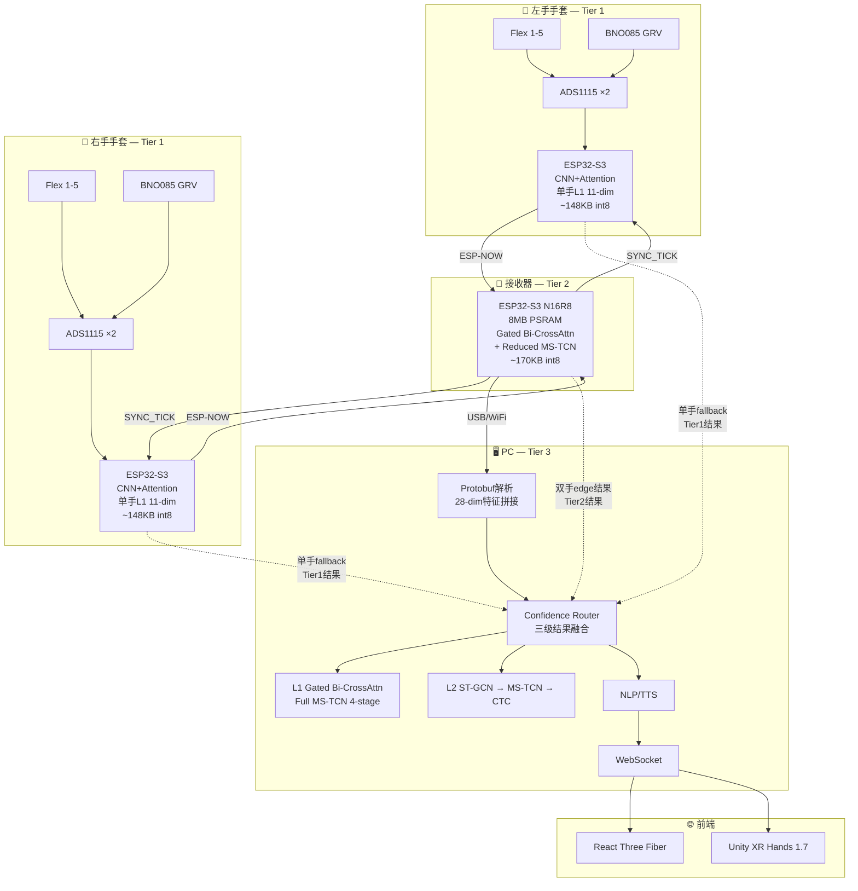
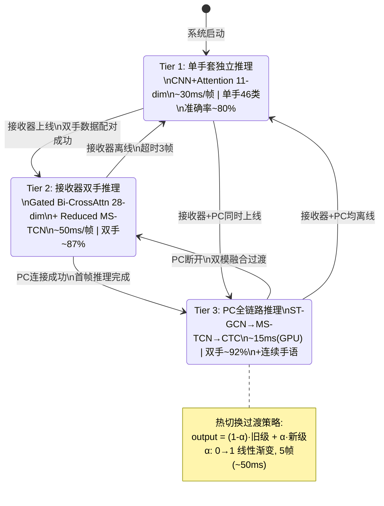
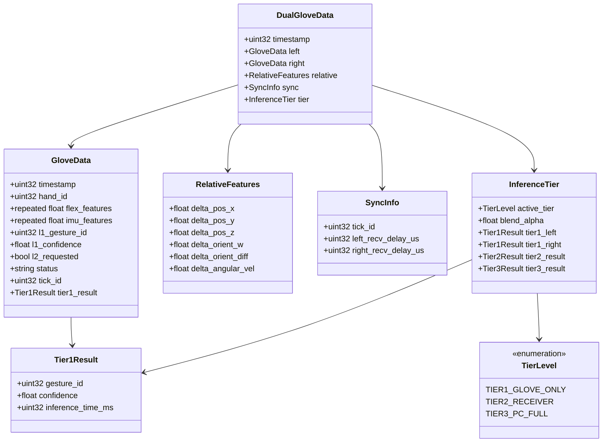
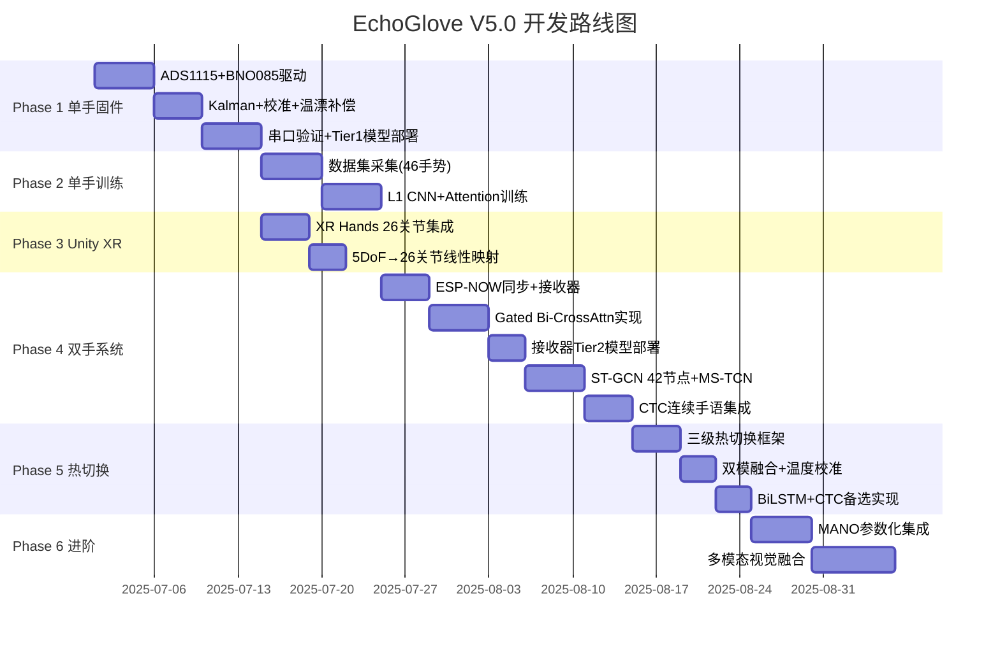

# EchoGlove V5.0 双手架构图集

> 版本: V5.0 | 三级热切换 + Gated Bi-CrossAttention + ST-GCN→MS-TCN→CTC

---

## 1. 系统总架构 — 三级热切换（Mermaid）



---

## 2. 三级热切换状态机（Mermaid）



---

## 3. Gated Bidirectional CrossAttention 详细架构（Mermaid）

```mermaid
flowchart TB
    subgraph Input["输入"]
        LEFT[左手 11-dim<br/>Conv1D → feat_L 64-dim]
        RIGHT[右手 11-dim<br/>Conv1D → feat_R 64-dim]
    end

    subgraph SelfAttn["各手自注意力"]
        LSELF[左手 Self-Attention<br/>Q_L=K_L=V_L=feat_L]
        RSELF[右手 Self-Attention<br/>Q_R=K_R=V_R=feat_R]
    end

    subgraph BiCross["双向CrossAttention"]
        L2R[Left→Right<br/>Q=feat_L, K=V=feat_R<br/>Attn_L2R = softmax·V_R]
        R2L[Right→Left<br/>Q=feat_R, K=V=feat_L<br/>Attn_R2L = softmax·V_L]
    end

    subgraph Gating["门控机制 🔑"]
        GL[左手门控<br/>gate_L = σ(W·[feat_L; Attn_L2R])<br/>out_L = gate_L⊙Attn_L2R + (1-gate_L)⊙feat_L]
        GR[右手门控<br/>gate_R = σ(W·[feat_R; Attn_R2L])<br/>out_R = gate_R⊙Attn_R2L + (1-gate_R)⊙feat_R]
    end

    subgraph Fusion["融合输出"]
        REL[相对特征 6-dim<br/>FC → 64-dim]
        CAT[Concatenate<br/>out_L + out_R + REL<br/>= 64×3 = 192-dim]
        OUT[FC 192→128→num_classes]
    end

    LEFT --> LSELF --> BiCross
    RIGHT --> RSELF --> BiCross
    LSELF --> L2R
    RSELF --> R2L
    L2R --> GL
    R2L --> GR
    LSELF --> GL
    RSELF --> GR
    GL --> CAT
    GR --> CAT
    REL --> CAT
    CAT --> OUT

    style Gating fill:#ffa,stroke:#333
    style GL fill:#ff9,stroke:#333
    style GR fill:#ff9,stroke:#333
```

---

## 4. L2 三阶段流水线: ST-GCN → MS-TCN → CTC（Mermaid）

```mermaid
flowchart LR
    subgraph Spatial["阶段1: 空间图卷积"]
        INPUT[28-dim 序列<br/>T×28] --> PROJ[Linear 28→84<br/>42节点×2坐标]
        PROJ --> STG1[ST-Conv Block 1<br/>42节点 66边]
        STG1 --> STG2[ST-Conv Block 2]
        STG2 --> STG3[ST-Conv Block 3]
        STG3 --> SPOOL[Temporal Pool<br/>→ T×64 特征]
    end

    subgraph Temporal["阶段2: MS-TCN时序精炼"]
        SPOOL --> MS1[Stage 1<br/>10层膨胀卷积<br/>dilation 1,2,4...512<br/>RF=1023帧]
        MS1 --> PRED1[预测 T×C]
        PRED1 --> MS2[Stage 2<br/>精炼上阶段预测]
        MS2 --> PRED2[预测 T×C]
        PRED2 --> MS3[Stage 3<br/>精炼]
        MS3 --> PRED3[预测 T×C]
        PRED3 --> MS4[Stage 4<br/>最终精炼]
        MS4 --> PRED4[预测 T×C<br/>+ Smoothing Loss]
    end

    subgraph Decode["阶段3: CTC解码"]
        PRED4 --> SOFT[LogSoftmax<br/>+ CTC blank类]
        SOFT --> CTC[CTC Loss<br/>训练: 对齐标签]
        CTC --> BEAM[Beam Search<br/>k=10 解码]
        BEAM --> WORDS[词序列输出<br/>连续手语翻译]
    end
```



---

## 5. 三级推理详细规格对比

```
┌─────────────────── 三级热切换推理架构 ───────────────────┐
│                                                          │
│  Tier 1: 手套端 (每只手套独立)                           │
│  ┌──────────────────────────────────────────┐            │
│  │ 模型: CNN + SE-Attention                 │            │
│  │ 输入: 11-dim (5 Flex + 6 IMU)           │            │
│  │ 输出: 46类手势概率                        │            │
│  │ 大小: ~148KB int8                        │            │
│  │ 延迟: ~30ms/帧 (ESP32-S3 240MHz)        │            │
│  │ 场景: 离线/单手/应急                      │            │
│  │ 精度: ~80% (单手静态)                     │            │
│  └──────────────────────────────────────────┘            │
│           │ ESP-NOW                                       │
│           ▼                                               │
│  Tier 2: 接收器 (双手融合)                                │
│  ┌──────────────────────────────────────────┐            │
│  │ 模型: CNN + Gated Bi-CrossAttn           │            │
│  │       + Reduced MS-TCN (2-stage)         │            │
│  │ 输入: 28-dim (11×2手 + 6相对)            │            │
│  │ 输出: 46类 + 时序分割                     │            │
│  │ 大小: ~170KB int8                        │            │
│  │ 延迟: ~50ms/帧 (ESP32-S3 + PSRAM)       │            │
│  │ 场景: 无PC时主力推理                      │            │
│  │ 精度: ~87% (双手静态+简单动态)            │            │
│  └──────────────────────────────────────────┘            │
│           │ USB/WiFi                                      │
│           ▼                                               │
│  Tier 3: PC (全链路)                                      │
│  ┌──────────────────────────────────────────┐            │
│  │ L1: CNN + Gated Bi-CrossAttn             │            │
│  │     + Full MS-TCN (4-stage)              │            │
│  │ L2: ST-GCN (42节点) → MS-TCN (4-stage)  │            │
│  │     → CTC Beam Search                    │            │
│  │ 输入: 28-dim × 30帧滑动窗口              │            │
│  │ 输出: 连续手语词序列                      │            │
│  │ 大小: ~3-5MB (FP32 GPU)                  │            │
│  │ 延迟: ~15ms/帧 (GPU) / ~80ms (CPU)      │            │
│  │ 场景: 在线全功能                          │            │
│  │ 精度: ~92% (双手+连续手语)                │            │
│  └──────────────────────────────────────────┘            │
└──────────────────────────────────────────────────────────┘
```

---

## 6. 热切换过渡算法（ASCII）

```
时间轴:  t=0      t=1      t=2      t=3      t=4      t=5
         │        │        │        │        │        │
Tier2:   ████████████████░░░░░░░░░░░░░░░░░░░░░  (旧级逐渐退出)
         │        │        │  α=0.6 │  α=0.2 │  α=0   │
Tier3:   ░░░░░░░░░░░░░░░░██████████████████████  (新级逐渐接管)
         │        │        │  α=0.4 │  α=0.8 │  α=1.0 │
         │        │        │        │        │        │
输出:    T2_only  T2_only  Blend    Blend    T3_only  T3_only
         100%T2   100%T2   60%T2   20%T2    100%T3   100%T3
                          +40%T3   +80%T3

融合公式:
  output(t) = (1 - α(t)) · result_old + α(t) · result_new
  α(t) = clamp((t - t_switch) / N_blend, 0, 1)
  N_blend = 5帧 (~50ms过渡)

温度校准:
  两个模型的softmax温度在验证集上对齐:
  T_calibrated = T_raw / τ,  τ由验证集KL散度最小化确定
```

---

## 7. Protobuf V5.0 消息结构（Mermaid类图）



---

## 8. MS-TCN 内部结构详解（ASCII）

```
输入: ST-GCN输出特征 T×64 (每帧64维空间特征)
                    │
    ┌───────────────┼───────────────┐
    │          Stage 1              │  ← 特征提取阶段
    │  Conv1D(64→64,k=3,d=1)       │
    │  Conv1D(64→64,k=3,d=2)       │  dilation逐层指数增长
    │  Conv1D(64→64,k=3,d=4)       │
    │  Conv1D(64→64,k=3,d=8)       │  RF = 1+2(2^10-1) = 2047帧
    │  Conv1D(64→64,k=3,d=16)      │
    │  Conv1D(64→64,k=3,d=32)      │
    │  Conv1D(64→64,k=3,d=64)      │
    │  Conv1D(64→64,k=3,d=128)     │
    │  Conv1D(64→64,k=3,d=256)     │
    │  Conv1D(64→64,k=3,d=512)     │
    │  Conv1D(64→C,k=1) → Pred_1   │  C=46+1(含CTC blank)
    └───────────────┬───────────────┘
                    │
    ┌───────────────┼───────────────┐
    │          Stage 2              │  ← 精炼阶段
    │  Input: [Pred_1; ST-GCN feat] │  拼接上阶段预测+原始特征
    │  Conv1D(C+64→64,k=3,d=1)     │
    │  ... (10层膨胀卷积)           │
    │  Conv1D(64→C,k=1) → Pred_2   │
    └───────────────┬───────────────┘
                    │
    ┌───────────────┼───────────────┐
    │          Stage 3              │  ← 精炼阶段
    │  Input: [Pred_2; ST-GCN feat] │
    │  ... (10层膨胀卷积)           │
    │  → Pred_3                     │
    └───────────────┬───────────────┘
                    │
    ┌───────────────┼───────────────┐
    │          Stage 4              │  ← 最终精炼
    │  Input: [Pred_3; ST-GCN feat] │
    │  ... (10层膨胀卷积)           │
    │  → Pred_4 (final)             │
    └───────────────┬───────────────┘
                    │
                    ▼
          LogSoftmax → CTC Loss
                    │
                    ▼
          Beam Search (k=10)
                    │
                    ▼
          连续手语词序列
```

---

## 9. 模型选型决策矩阵（ASCII）

```
┌─────────────────┬──────────┬──────────┬──────────┬──────────┬──────────┐
│     模型        │  L1边缘  │  L1 PC   │  L2 PC   │  时序分割 │  创新性  │
├─────────────────┼──────────┼──────────┼──────────┼──────────┼──────────┤
│ CNN+Attention   │  ✅ 主力 │  ✅ 单流 │  ❌      │  ❌      │  ⭐⭐    │
│                 │  11-dim  │  骨干    │          │          │          │
├─────────────────┼──────────┼──────────┼──────────┼──────────┼──────────┤
│ Gated Bi-Cross  │  ⚠️ 接收 │  ✅ 主力 │  ❌      │  ❌      │  ⭐⭐⭐⭐│
│ Attention       │  器可用  │  L1融合  │          │          │  学术空白│
├─────────────────┼──────────┼──────────┼──────────┼──────────┼──────────┤
│ MS-TCN          │  ⚠️ 减配 │  ✅ L2   │  ✅ 主力 │  ✅ 最优 │  ⭐⭐⭐  │
│                 │  2-stage │  时序    │  时序    │          │  ICASSP  │
├─────────────────┼──────────┼──────────┼──────────┼──────────┼──────────┤
│ ST-GCN+CTC      │  ❌      │  ❌      │  ✅ 空间 │  ⚠️ 基础 │  ⭐⭐⭐  │
│                 │          │          │  图结构   │          │          │
├─────────────────┼──────────┼──────────┼──────────┼──────────┼──────────┤
│ BiLSTM+CTC      │  ❌      │  ⚠️ 备选 │  ⚠️ 备选 │  ✅ 良好 │  ⭐⭐    │
│                 │          │  无GPU时 │  无GPU时 │          │  量化难  │
└─────────────────┴──────────┴──────────┴──────────┴──────────┴──────────┘

V5.0 最终选型:
  L1 Edge:  CNN+Attention (11-dim, 手套端)
  L1 Edge+: CNN + Gated Bi-CrossAttn + MS-TCN 2-stage (28-dim, 接收器端)
  L1 PC:    CNN + Gated Bi-CrossAttn + MS-TCN 4-stage (28-dim, PC端)
  L2 PC:    ST-GCN(42节点) → MS-TCN(4-stage) → CTC (PC端, GPU加速)
  L2 备选:  BiLSTM+CTC (PC端, 无GPU场景)
```

---

## 10. 开发阶段甘特图 V5.0（Mermaid）


