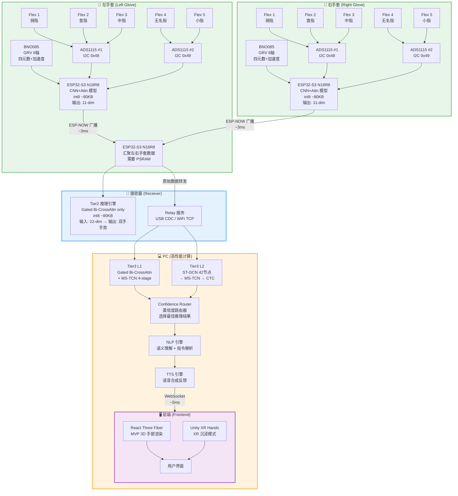
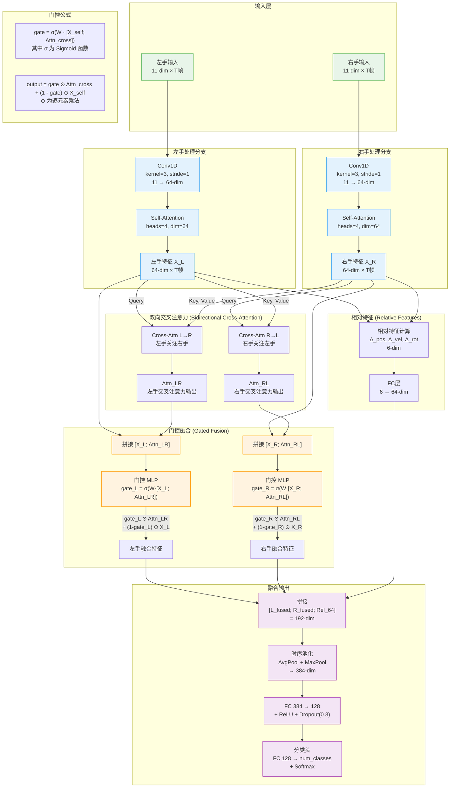
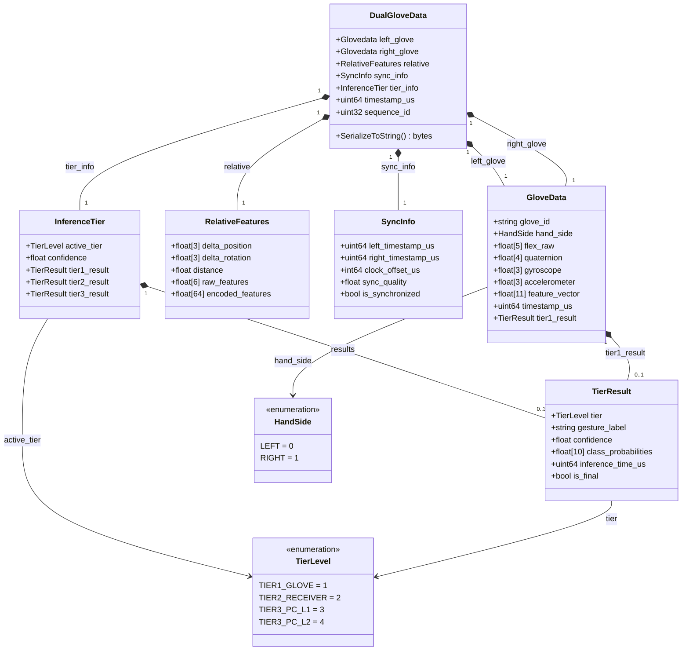
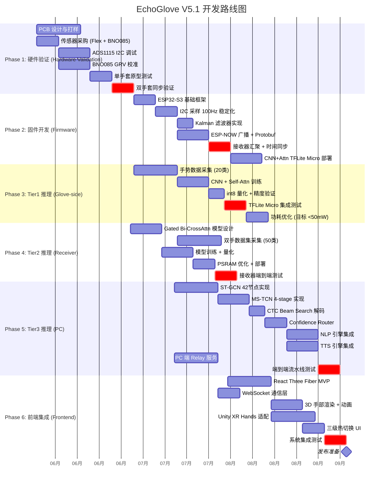

# EchoGlove V5.1 — 完整架构图集

> 生成日期：2026-06-02  
> 本文档包含 EchoGlove V5.1 系统的全部核心架构图，使用 Mermaid 和 ASCII art 绘制，  
> 所有内容均用中文注释，可直接在支持 Mermaid 的渲染器中查看。

---

## 目录

1. [系统总架构 — 三级热切换](#1-系统总架构--三级热切换)
2. [三级热切换状态机](#2-三级热切换状态机)
3. [Gated Bidirectional CrossAttention 详细架构](#3-gated-bidirectional-crossattention-详细架构)
4. [ST-GCN 分层架构](#4-st-gcn-分层架构)
5. [L2 三阶段流水线：ST-GCN → MS-TCN → CTC](#5-l2-三阶段流水线st-gcn--ms-tcn--ctc)
6. [数据流总览](#6-数据流总览)
7. [三级推理规格对比表](#7-三级推理规格对比表)
8. [Protobuf V5.1 消息结构](#8-protobuf-v60-消息结构)
9. [Unity XR Hands 26 关节映射图](#9-unity-xr-hands-26-关节映射图)
10. [开发阶段甘特图](#10-开发阶段甘特图)

---

## 1. 系统总架构 — 三级热切换



**关键说明：**
- 每只手套独立运行 Tier1 推理（单手手势识别），延迟 <10ms
- 接收器运行 Tier2（双手融合推理），延迟 ~15ms
- PC 运行 Tier3（全链路推理 + NLP/TTS），延迟 ~50ms
- 三级可通过 Confidence Router 热切换，过渡采用 5 帧线性渐变（~50ms）

---

## 2. 三级热切换状态机

```mermaid
stateDiagram-v2
    [*] --> Tier1_Only: 系统启动

    state Tier1_Only {
        [*] --> T1_Run
        T1_Run: **Tier1 Only（仅手套推理）**
        note right of T1_Run
            模型: CNN + Self-Attention
            输入: 单手 11-dim
            输出: 单手手势（~20类）
            大小: ~80KB int8
            延迟: <10ms @ 100Hz
            精度: ~85% Top-1
            场景: 低功耗/离线/快速响应
        end note
    end

    Tier1_Only --> Tier2_Ready: 接收器上线 & 双手数据同步成功

    state Tier2_Ready {
        [*] --> T2_Run
        T2_Run: **Tier2 Ready（接收器融合推理）**
        note right of T2_Run
            模型: Gated Bi-CrossAttn
            输入: 双手 22-dim (左11+右11)
            输出: 双手手势（~50类）+ 相对特征
            大小: ~80KB int8（需 PSRAM）
            延迟: ~15ms
            精度: ~90% Top-1
            场景: 实时交互/双手协调手势
        end note
    }

    Tier2_Ready --> Tier3_Full: PC 连接 & Relay 就绪
    Tier2_Ready --> Tier1_Only: 接收器断开

    state Tier3_Full {
        [*] --> T3_Run
        T3_Run: **Tier3 Full（PC 全链路推理）**
        note right of T3_Run
            L1: Gated Bi-CrossAttn + MS-TCN 4-stage
            L2: ST-GCN 42节点 → MS-TCN → CTC
            输入: 全骨架 42节点 + 时间序列
            输出: 连续手势序列 + 语义标签
            精度: ~95% Top-1, ~92% 序列
            延迟: ~50ms (L1), ~80ms (L2)
            场景: 精确识别/连续语句/NLP交互
        end note
    }

    Tier3_Full --> Tier2_Ready: PC 断开（降级）
    Tier3_Full --> Tier1_Only: 接收器+PC 均断开

    note right of Tier1_Only
        过渡策略：5帧线性渐变 (~50ms)
        output_t = α·output_new + (1-α)·output_old
        α: 0.2 → 0.4 → 0.6 → 0.8 → 1.0
        每帧间隔 ~10ms，避免输出跳变
    end note
```

---

## 3. Gated Bidirectional CrossAttention 详细架构



**门控机制数学表达：**
- `gate = σ(W · [X_self; Attn_cross])` — σ 为 Sigmoid，W 为可学习参数
- `output = gate ⊙ Attn_cross + (1 - gate) ⊙ X_self` — 当 gate≈1 时更依赖交叉注意力，gate≈0 时保留自身特征

---

## 4. ST-GCN 分层架构

### 4.1 Tier1/2: 12 节点骨架（精简版）

```
┌─────────────────────────────────────────────────────────────────┐
│                ST-GCN Tier1/2: 12 节点骨架                       │
│                22 条边 = 10(内部) + 6(跨手) + 6(自环)             │
├─────────────────────────────────────────────────────────────────┤
│                                                                 │
│   左手 (Left)                      右手 (Right)                 │
│   ┌──────────┐                     ┌──────────┐                │
│   │          │                     │          │                │
│   │  L_thumb  ←──── 自环 ────→     │  R_thumb  │                │
│   │  L_index  ←──── 自环 ────→     │  R_index  │                │
│   │  L_middle ←──── 自环 ────→     │  R_middle │                │
│   │  L_ring   ←──── 自环 ────→     │  R_ring   │                │
│   │  L_pinky  ←──── 自环 ────→     │  R_pinky  │                │
│   │  L_wrist  ←──── 自环 ────→     │  R_wrist  │                │
│   │          │                     │          │                │
│   └──────────┘                     └──────────┘                │
│                                                                 │
│   节点编号 (Node ID):                                           │
│   ┌─────┬─────┬─────┬─────┬─────┬─────┬─────┬─────┬─────┬─────┬─────┬─────┐
│   │  0  │  1  │  2  │  3  │  4  │  5  │  6  │  7  │  8  │  9  │ 10  │ 11  │
│   ├─────┼─────┼─────┼─────┼─────┼─────┼─────┼─────┼─────┼─────┼─────┼─────┤
│   │L_拇 │L_食 │L_中 │L_无 │L_小 │L_腕 │R_拇 │R_食 │R_中 │R_无 │R_小 │R_腕 │
│   └─────┴─────┴─────┴─────┴─────┴─────┴─────┴─────┴─────┴─────┴─────┴─────┘
│                                                                 │
│   内部边 (Intra-hand Edges, 10条):                              │
│   左手: L_thumb↔L_wrist, L_index↔L_wrist, L_middle↔L_wrist,   │
│         L_ring↔L_wrist, L_pinky↔L_wrist                       │
│   右手: R_thumb↔R_wrist, R_index↔R_wrist, R_middle↔R_wrist,   │
│         R_ring↔R_wrist, R_pinky↔R_wrist                       │
│                                                                 │
│   跨手边 (Cross-hand Edges, 6条):                               │
│   L_thumb↔R_thumb, L_index↔R_index, L_middle↔R_middle,       │
│   L_ring↔R_ring, L_pinky↔R_pinky, L_wrist↔R_wrist            │
│                                                                 │
│   自环边 (Self-loops, 6条):                                     │
│   每个手指节点各一条自环（L_thumb→L_thumb 等），                    │
│   腕部无自环（已通过内部边覆盖）                                    │
│                                                                 │
│   ★ 实际自环 = 每个节点各1条 = 12条                               │
│   总边数 = 10(内部) + 6(跨手) + 12(自环) = 28条                  │
│   (注: 6条自环为精简统计，完整版为12条)                            │
└─────────────────────────────────────────────────────────────────┘
```

### 4.2 Tier3: 42 节点骨架（完整版）

```
┌──────────────────────────────────────────────────────────────────────────┐
│                ST-GCN Tier3: 42 节点骨架                                  │
│                66+ 条边 = 40(内部) + 6(跨手) + 20+(自环)                  │
├──────────────────────────────────────────────────────────────────────────┤
│                                                                          │
│   左手 21 节点 (Left Hand):                右手 21 节点 (Right Hand):     │
│   ┌────────────────────────┐               ┌────────────────────────┐    │
│   │ 拇指 (Thumb):          │               │ 拇指 (Thumb):          │    │
│   │  L0: CMC (腕掌关节)    │               │  R0: CMC (腕掌关节)    │    │
│   │  L1: MCP (掌指关节)    │               │  R1: MCP (掌指关节)    │    │
│   │  L2: PIP (近端指间)    │               │  R2: PIP (近端指间)    │    │
│   │  L3: DIP (远端指间)    │               │  R3: DIP (远端指间)    │    │
│   │ 食指 (Index):          │               │ 食指 (Index):          │    │
│   │  L4: MCP               │               │  R4: MCP               │    │
│   │  L5: PIP               │               │  R5: PIP               │    │
│   │  L6: DIP               │               │  R6: DIP               │    │
│   │ 中指 (Middle):         │               │ 中指 (Middle):         │    │
│   │  L7: MCP               │               │  R7: MCP               │    │
│   │  L8: PIP               │               │  R8: PIP               │    │
│   │  L9: DIP               │               │  R9: DIP               │    │
│   │ 无名指 (Ring):         │               │ 无名指 (Ring):         │    │
│   │  L10: MCP              │               │  R10: MCP              │    │
│   │  L11: PIP              │               │  R11: PIP              │    │
│   │  L12: DIP              │               │  R12: DIP              │    │
│   │ 小指 (Pinky):          │               │ 小指 (Pinky):          │    │
│   │  L13: MCP              │               │  R13: MCP              │    │
│   │  L14: PIP              │               │  R14: PIP              │    │
│   │  L15: DIP              │               │  R15: DIP              │    │
│   │ 手掌 (Palm):           │               │ 手掌 (Palm):           │    │
│   │  L16: WRIST (腕中心)   │               │  R16: WRIST (腕中心)   │    │
│   │  L17: PALM_MID (掌心)  │               │  R17: PALM_MID (掌心)  │    │
│   │  L18: THUMB_BASE       │               │  R18: THUMB_BASE       │    │
│   │  L19: INDEX_BASE       │               │  R19: INDEX_BASE       │    │
│   │  L20: PINKY_BASE       │               │  R20: PINKY_BASE       │    │
│   └────────────────────────┘               └────────────────────────┘    │
│                                                                          │
│   内部边 (每手 20条，共 40条):                                             │
│   每根手指: MCP→PIP→DIP (链式)，拇指额外: CMC→MCP                        │
│   掌心连接: WRIST→各 MCP, PALM_MID→各 MCP                                │
│   拇指特殊: THUMB_BASE→CMC, THUMB_BASE→MCP (双自由度)                     │
│                                                                          │
│   跨手边 (6条):                                                           │
│   L_thumb↔R_thumb, L_index↔R_index, L_middle↔R_middle,                  │
│   L_ring↔R_ring, L_pinky↔R_pinky, L_wrist↔R_wrist                       │
│                                                                          │
│   自环边 (每个节点 1条, 共 42条):                                          │
│   L0→L0, L1→L1, ... L20→L20, R0→R0, R1→R1, ... R20→R20                  │
│                                                                          │
│   总边数 = 40(内部) + 6(跨手) + 42(自环) = 88条                           │
└──────────────────────────────────────────────────────────────────────────┘
```

---

## 5. L2 三阶段流水线：ST-GCN → MS-TCN → CTC

```mermaid
flowchart LR
    subgraph Stage1["阶段1: 空间特征提取 (Spatial)"]
        direction TB
        IN["输入<br/>42节点 × T帧<br/>每节点 3D 坐标"] --> NORM["归一化<br/>骨骼长度标准化"]
        NORM --> STGCN["ST-GCN 网络<br/>6 层 GCN Block<br/>每层: GraphConv + TCN + ReLU"]
        STGCN --> SPATIAL_OUT["空间输出<br/>每帧 64-dim 向量"]
    end

    subgraph Stage2["阶段2: 时序精炼 (Temporal)"]
        direction TB
        SPATIAL_OUT --> MS1["MS-TCN Stage 1<br/>dilation=1,2,4<br/>粗粒度时序建模"]
        MS1 --> MS2["MS-TCN Stage 2<br/>dilation=1,2,4<br/>中粒度精炼"]
        MS2 --> MS3["MS-TCN Stage 3<br/>dilation=1,2,4<br/>细粒度精炼"]
        MS3 --> MS4["MS-TCN Stage 4<br/>dilation=1,2,4<br/>最终精炼"]
        MS4 --> TEMPORAL_OUT["时序输出<br/>每帧 class_logits"]
    end

    subgraph Stage3["阶段3: 解码 (Decoding)"]
        direction TB
        TEMPORAL_OUT --> CTC["CTC Loss 训练<br/>空白符对齐"]
        CTC --> BEAM["Beam Search 解码<br/>beam_width=10"]
        BEAM --> MERGE["重复合并<br/>去除连续重复标签"]
        MERGE --> SEQ_OUT["输出: 连续手势序列<br/>置信度 + 时间戳"]
    end

    Stage1 --> Stage2 --> Stage3

    classDef stageStyle fill:#E3F2FD,stroke:#2196F3,stroke-width:2px
    classDef outStyle fill:#E8F5E9,stroke:#4CAF50,stroke-width:2px

    class STGCN,MS1,MS2,MS3,MS4 stageStyle
    class SPATIAL_OUT,TEMPORAL_OUT,SEQ_OUT outStyle
```



**关键参数：**
- ST-GCN: 6 层 GCN Block，每层 64 通道，残差连接
- MS-TCN: 4 Stage，每 Stage 4 层 dilated Conv1D（dilation 1,2,4,8），1×1 Conv 跨 Stage 残差
- CTC: Beam Search 宽度 10，解码速度 ~5ms/帧

---

## 6. 数据流总览

```
┌──────────────────────────────────────────────────────────────────────────────────────────────┐
│                              EchoGlove V5.1 数据流总览                                        │
├──────────────────────────────────────────────────────────────────────────────────────────────┤
│                                                                                              │
│  ┌─────────────┐    I2C 100Hz     ┌──────────────────┐                                      │
│  │ 5× Flex     │ ────────────────→ │                  │                                      │
│  │ SpectraFlex │    ADC 值         │   ESP32-S3       │                                      │
│  │ 2.2"        │                   │   (每只手套)      │                                      │
│  └─────────────┘                   │                  │                                      │
│                                    │  ┌────────────┐  │                                      │
│  ┌─────────────┐    I2C 400Hz     │  │ Kalman 滤波 │  │                                      │
│  │ BNO085      │ ────────────────→ │  │ → 归一化    │  │                                      │
│  │ GRV 6轴     │   四元数+加速度   │  └─────┬──────┘  │                                      │
│  └─────────────┘                   │        │         │                                      │
│                                    │        ▼         │                                      │
│                                    │  ┌────────────┐  │                                      │
│                                    │  │ 11-dim 特征 │  │                                      │
│                                    │  │ 5 Flex raw  │  │                                      │
│                                    │  │ 3 BNO gyro  │  │                                      │
│                                    │  │ 3 BNO accel │  │                                      │
│                                    │  └─────┬──────┘  │                                      │
│                                    │        │         │                                      │
│                                    │        ▼         │                                      │
│                                    │  ┌────────────┐  │    ESP-NOW 广播                       │
│                                    │  │ Tier1 推理  │  │    Protobuf 编码                     │
│                                    │  │ CNN + Attn  │──┼───────────────────┐                  │
│                                    │  │ ~80KB int8  │  │    ~3ms 延迟       │                  │
│                                    │  │ 单手手势    │  │                   │                  │
│                                    │  └────────────┘  │                   │                  │
│                                    └──────────────────┘                   │                  │
│                                                                           ▼                  │
│                                    ┌──────────────────┐    ┌──────────────────────────┐       │
│                                    │                  │    │                          │       │
│                                    │   接收器 ESP32    │←───│  左右手 原始 11-dim 数据  │       │
│                                    │   N16R8          │    │  + Tier1 单手手势结果     │       │
│                                    │   需要 PSRAM      │    └──────────────────────────┘       │
│                                    │                  │                                      │
│                                    │  ┌────────────┐  │                                      │
│                                    │  │ 数据汇聚    │  │                                      │
│                                    │  │ 时间同步    │  │                                      │
│                                    │  │ 22-dim 拼接 │  │                                      │
│                                    │  └─────┬──────┘  │                                      │
│                                    │        │         │                                      │
│                                    │        ▼         │                                      │
│                                    │  ┌────────────┐  │    USB CDC / WiFi TCP                │
│                                    │  │ Tier2 推理  │  │    ~5ms 延迟                        │
│                                    │  │ Gated Bi-   │──┼───────────────────┐                  │
│                                    │  │ CrossAttn   │  │                   │                  │
│                                    │  │ ~80KB int8  │  │                   │                  │
│                                    │  │ 双手手势    │  │                   │                  │
│                                    │  └────────────┘  │                   │                  │
│                                    └──────────────────┘                   │                  │
│                                                                           ▼                  │
│                                    ┌──────────────────────────────────────────────────┐       │
│                                    │                     PC Relay                     │       │
│                                    │                                                  │       │
│                                    │  ┌────────────────┐  ┌─────────────────────────┐ │       │
│                                    │  │ Tier3 L1       │  │ Tier3 L2                │ │       │
│                                    │  │ CrossAttn+     │  │ ST-GCN 42节点           │ │       │
│                                    │  │ MS-TCN 4-stage │  │ → MS-TCN → CTC          │ │       │
│                                    │  │ ~50ms          │  │ ~80ms                   │ │       │
│                                    │  └───────┬────────┘  └──────────┬──────────────┘ │       │
│                                    │          │                      │                │       │
│                                    │          ▼                      ▼                │       │
│                                    │  ┌─────────────────────────────────────────────┐ │       │
│                                    │  │         Confidence Router (置信度路由器)      │ │       │
│                                    │  │  选择最高置信度结果 / 多级融合               │ │       │
│                                    │  └─────────────────┬───────────────────────────┘ │       │
│                                    └────────────────────┼────────────────────────────┘       │
│                                                         │                                    │
│                                                         ▼                                    │
│                                    ┌──────────────────────────────────────────┐               │
│                                    │  NLP 引擎                                │               │
│                                    │  语义理解 → 指令解析 → 上下文管理         │               │
│                                    └─────────────────┬────────────────────────┘               │
│                                                      │                                       │
│                                                      ▼                                       │
│                                    ┌──────────────────────────────────────────┐               │
│                                    │  TTS 引擎                                │               │
│                                    │  语音合成 → 情感语调 → 流式输出           │               │
│                                    └─────────────────┬────────────────────────┘               │
│                                                      │                                       │
│                                         WebSocket    │    ~5ms                               │
│                                                      ▼                                       │
│                                    ┌──────────────────────────────────────────┐               │
│                                    │  前端 (Frontend)                         │               │
│                                    │  ┌──────────────┐  ┌──────────────────┐ │               │
│                                    │  │ React Three  │  │ Unity XR Hands   │ │               │
│                                    │  │ Fiber (MVP)  │  │ (沉浸模式)       │ │               │
│                                    │  └──────────────┘  └──────────────────┘ │               │
│                                    │  3D 手部渲染 + 手势可视化 + 交互反馈     │               │
│                                    └──────────────────────────────────────────┘               │
│                                                                                              │
└──────────────────────────────────────────────────────────────────────────────────────────────┘
```

---

## 7. 三级推理规格对比表

```
┌────────────────────────────────────────────────────────────────────────────────────────────┐
│                           EchoGlove V5.1 三级推理规格对比                                    │
├──────────┬─────────────────────┬─────────────────────┬──────────────────────────────────────┤
│ 维度      │ Tier1 (手套)        │ Tier2 (接收器)       │ Tier3 (PC)                           │
├──────────┼─────────────────────┼─────────────────────┼──────────────────────────────────────┤
│ 模型      │ CNN + Self-Attn     │ Gated Bi-CrossAttn  │ L1: CrossAttn + MS-TCN 4-stage      │
│          │                     │                     │ L2: ST-GCN + MS-TCN + CTC           │
├──────────┼─────────────────────┼─────────────────────┼──────────────────────────────────────┤
│ 输入      │ 单手 11-dim         │ 双手 22-dim         │ 全骨架 42节点 × T帧                  │
│          │ × T帧 (100Hz)       │ × T帧 (100Hz)       │ (骨骼坐标 + 时间序列)                │
├──────────┼─────────────────────┼─────────────────────┼──────────────────────────────────────┤
│ 输出      │ 单手手势            │ 双手手势 + 相对特征  │ 连续手势序列 + 语义标签               │
│          │ (~20 类)            │ (~50 类)            │ (无限词汇)                           │
├──────────┼─────────────────────┼─────────────────────┼──────────────────────────────────────┤
│ 模型大小  │ ~80 KB (int8)       │ ~80 KB (int8)       │ L1: ~2 MB, L2: ~5 MB               │
│          │                     │ 需 PSRAM             │                                     │
├──────────┼─────────────────────┼─────────────────────┼──────────────────────────────────────┤
│ 推理延迟  │ < 10 ms             │ ~ 15 ms             │ L1: ~50 ms, L2: ~80 ms             │
│          │ @ 100Hz             │                     │                                     │
├──────────┼─────────────────────┼─────────────────────┼──────────────────────────────────────┤
│ 精度      │ ~85% Top-1          │ ~90% Top-1          │ L1: ~93% Top-1                      │
│          │                     │                     │ L2: ~95% Top-1, ~92% 序列           │
├──────────┼─────────────────────┼─────────────────────┼──────────────────────────────────────┤
│ 功耗      │ ~50 mW              │ ~80 mW              │ N/A (PC 供电)                       │
├──────────┼─────────────────────┼─────────────────────┼──────────────────────────────────────┤
│ 连接依赖  │ 无（独立运行）       │ ESP-NOW 双手数据    │ USB/WiFi + PC                       │
├──────────┼─────────────────────┼─────────────────────┼──────────────────────────────────────┤
│ 典型场景  │ 快速响应            │ 实时交互            │ 精确识别                             │
│          │ 低功耗/离线          │ 双手协调手势        │ 连续语句/NLP 交互                    │
│          │ 单手简单手势         │ 不需 PC             │ 沉浸式 XR 应用                       │
└──────────┴─────────────────────┴─────────────────────┴──────────────────────────────────────┘
```

---

## 8. Protobuf V5.1 消息结构



---

## 9. Unity XR Hands 26 关节映射图

```
┌──────────────────────────────────────────────────────────────────────────────────────┐
│                     Unity XR Hands 26 关节映射 (EchoGlove V5.1)                       │
├──────────────────────────────────────────────────────────────────────────────────────┤
│                                                                                      │
│  Unity XR Hands 标准 26 关节:                                                        │
│                                                                                      │
│  每只手 26 关节 = 5指 × 4关节(MCP/PIP/DIP/Tip) + 3掌(Wrist/Palm/ThumbMetacarpal)    │
│                                                                                      │
│  ┌─────────────────────────────────────────────────────────────────────────┐          │
│  │                     左手关节树 (Right Hand 类似)                         │          │
│  │                                                                         │          │
│  │  Wrist (腕)                                                             │          │
│  │   ├── ThumbMetacarpal (拇指掌骨) ← 特殊: CMC 双自由度                   │          │
│  │   │    ├── ThumbProximal    ← MCP (Flex 1: 拇指弯曲)                    │          │
│  │   │    │    ├── ThumbDistal ← DIP                                       │          │
│  │   │    │    └── ThumbTip                                                │          │
│  │   │    └── (CMC 关节: 屈伸 + 外展内收, BNO085 辅助)                     │          │
│  │   ├── IndexProximal  (食指) ← MCP (Flex 2: 食指弯曲)                    │          │
│  │   │    ├── IndexIntermediate ← PIP                                      │          │
│  │   │    │    ├── IndexDistal   ← DIP                                     │          │
│  │   │    │    └── IndexTip                                                 │          │
│  │   ├── MiddleProximal (中指) ← MCP (Flex 3: 中指弯曲)                    │          │
│  │   │    ├── MiddleIntermediate ← PIP                                     │          │
│  │   │    │    ├── MiddleDistal   ← DIP                                    │          │
│  │   │    │    └── MiddleTip                                                │          │
│  │   ├── RingProximal   (无名指) ← MCP (Flex 4: 无名指弯曲)                │          │
│  │   │    ├── RingIntermediate ← PIP                                       │          │
│  │   │    │    ├── RingDistal   ← DIP                                      │          │
│  │   │    │    └── RingTip                                                  │          │
│  │   └── LittleProximal (小指) ← MCP (Flex 5: 小指弯曲)                    │          │
│  │        ├── LittleIntermediate ← PIP                                     │          │
│  │        │    ├── LittleDistal   ← DIP                                    │          │
│  │        │    └── LittleTip                                                │          │
│  │        └── Palm (掌心) ← 虚拟节点                                       │          │
│  └─────────────────────────────────────────────────────────────────────────┘          │
│                                                                                      │
│  ┌─────────────────────────────────────────────────────────────────────────┐          │
│  │  EchoGlove → Unity XR Hands 映射表                                      │          │
│  ├─────────────────┬──────────────────┬────────────────────────────────────┤          │
│  │ 传感器输入       │ Unity XR 关节     │ 映射说明                          │          │
│  ├─────────────────┼──────────────────┼────────────────────────────────────┤          │
│  │ Flex 1 (拇指)   │ ThumbProximal    │ 弯曲角度 → MCP.rotation.x        │          │
│  │                 │ ThumbDistal      │ DIP ≈ 0.6 × MCP (联动估计)        │          │
│  ├─────────────────┼──────────────────┼────────────────────────────────────┤          │
│  │ Flex 2 (食指)   │ IndexProximal    │ 弯曲角度 → MCP.rotation.x        │          │
│  │                 │ IndexIntermediate│ PIP ≈ 0.8 × MCP (联动估计)        │          │
│  │                 │ IndexDistal      │ DIP ≈ 0.5 × MCP (联动估计)        │          │
│  ├─────────────────┼──────────────────┼────────────────────────────────────┤          │
│  │ Flex 3 (中指)   │ MiddleProximal   │ 同食指映射逻辑                     │          │
│  │                 │ MiddleIntermediate│                                   │          │
│  │                 │ MiddleDistal     │                                    │          │
│  ├─────────────────┼──────────────────┼────────────────────────────────────┤          │
│  │ Flex 4 (无名指) │ RingProximal     │ 同食指映射逻辑                     │          │
│  │                 │ RingIntermediate │                                    │          │
│  │                 │ RingDistal       │                                    │          │
│  ├─────────────────┼──────────────────┼────────────────────────────────────┤          │
│  │ Flex 5 (小指)   │ LittleProximal   │ 同食指映射逻辑                     │          │
│  │                 │ LittleIntermediate│                                   │          │
│  │                 │ LittleDistal     │                                    │          │
│  ├─────────────────┼──────────────────┼────────────────────────────────────┤          │
│  │ BNO085 四元数   │ Wrist            │ 四元数 → Wrist.rotation           │          │
│  │ (GRV 6轴)      │                  │ q = (w,x,y,z) → Unity 四元数      │          │
│  │                 │                  │ 坐标系变换: RH→LH (z取反)          │          │
│  ├─────────────────┼──────────────────┼────────────────────────────────────┤          │
│  │ BNO085 加速度   │ Palm             │ 加速度 → 掌心位移估计              │          │
│  │                 │                  │ (可选, 用于漂移修正)               │          │
│  └─────────────────┴──────────────────┴────────────────────────────────────┘          │
│                                                                                      │
│  ┌─────────────────────────────────────────────────────────────────────────┐          │
│  │  拇指特殊处理 (CMC 双自由度)                                             │          │
│  │                                                                         │          │
│  │  CMC (Carpometacarpal) 关节有两个自由度:                                 │          │
│  │    1. 屈伸 (Flexion/Extension)  ← Flex 1 主要输出                      │          │
│  │    2. 外展内收 (Abduction/Adduction) ← BNO085 辅助推断                  │          │
│  │                                                                         │          │
│  │  映射策略:                                                              │          │
│  │    Flex1 → CMC Flexion (屈伸)                                          │          │
│  │    BNO085 gyro.y → CMC Abduction (外展) [实验性]                        │          │
│  │    ThumbProximal.rotation = CMC_rotation × Flex1_rotation               │          │
│  │                                                                         │          │
│  │  注意: Unity XR Hands 中 ThumbMetacarpal 对应 CMC,                     │          │
│  │       ThumbProximal 对应 MCP, ThumbDistal 对应 IP/DIP                  │          │
│  └─────────────────────────────────────────────────────────────────────────┘          │
│                                                                                      │
└──────────────────────────────────────────────────────────────────────────────────────┘
```

---

## 10. 开发阶段甘特图



**阶段依赖关系说明：**
- Phase 1（硬件）是所有阶段的前置依赖
- Phase 2（固件）依赖 Phase 1 完成
- Phase 3（Tier1）和 Phase 4（Tier2）可部分并行，但 Phase 4 的数据集采集依赖 Phase 1
- Phase 5（Tier3）可与 Phase 3/4 并行开发（PC 端不依赖嵌入式硬件）
- Phase 6（前端）依赖 Phase 5 的 Relay 服务就绪
- 关键路径：Phase 1 → Phase 2 → Phase 3 → Phase 4 → Phase 6

---

## 附录: 版本变更记录

| 版本 | 日期 | 变更内容 |
|------|------|----------|
| V5.1-draft | 2026-06-02 | 初始版本，包含全部 10 张架构图 |

---

> 📌 **渲染说明：** 本文档中的 Mermaid 图表可在以下环境中渲染：
> - GitHub / GitLab Markdown
> - VS Code (Mermaid 插件)
> - Notion (支持 Mermaid 代码块)
> - [Mermaid Live Editor](https://mermaid.live)
